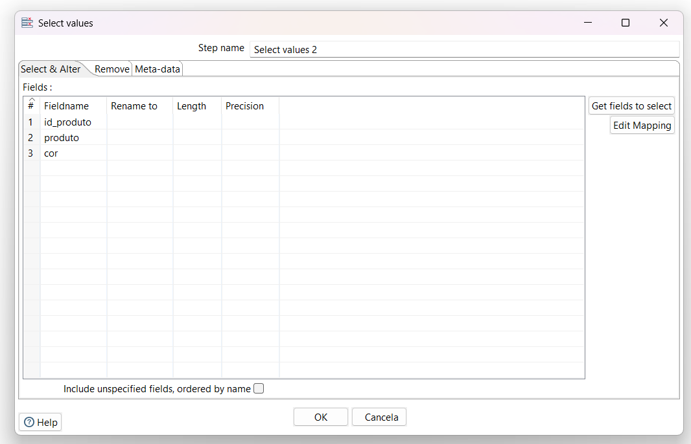
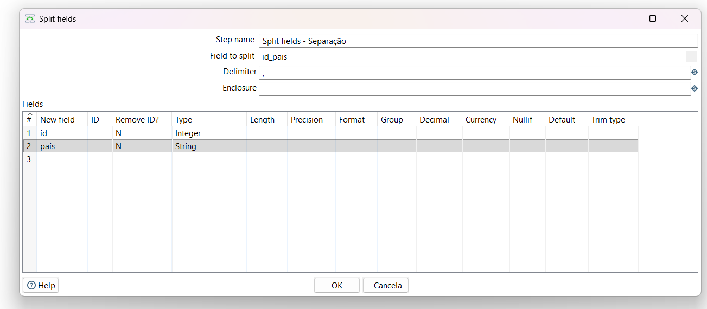
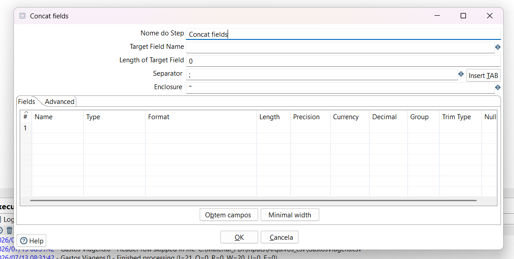

# CSV file input

Com certeza. O step **CSV file input** é um dos mais utilizados no Pentaho e possui configurações cruciais para garantir que os dados sejam lidos corretamente e com boa performance.

Abaixo, detalho o que cada campo e opção dessa tela faz, divididos por categorias para facilitar o entendimento:

### Configurações Básicas de Origem

* **Step name:** O nome do step dentro da sua Transformation. É uma boa prática dar nomes descritivos (ex: `CSV file input - Clientes`).
* **Filename:** O caminho completo onde o arquivo CSV está salvo. O botão "Navegar..." ajuda a localizar o arquivo no seu computador ou servidor.
* **Delimiter:** O caractere que separa as colunas no seu arquivo. O padrão é a vírgula (`,`), mas no Brasil é muito comum usarmos o ponto e vírgula (`;`) ou até mesmo o *Tab* (usando o botão "Insert TAB").
* **Enclosure:** O caractere usado para "empacotar" um texto que possa conter o delimitador dentro dele. Geralmente são aspas duplas (`"`). *Exemplo: Se o delimitador é vírgula e um campo de endereço é `"Rua ABC, 123"`, o enclosure garante que a vírgula dentro das aspas não quebre a coluna.*

### Performance e Otimização

* **NIO buffer size:** O tamanho da memória (em bytes) alocada para ler o arquivo em blocos. O valor padrão de `50000` costuma atender bem, mas pode ser aumentado para arquivos gigantescos visando ganhar velocidade de leitura.
* **Lazy conversion?:** Uma das opções mais importantes para performance. Se marcada, o Pentaho não converte os dados do CSV (que nascem como texto) para seus tipos finais (Integer, Date, etc.) imediatamente na leitura. Ele os mantém em um formato binário bruto e só faz a conversão mais para frente no fluxo, caso algum step exija (como um cálculo ou filtro). Se o dado for apenas passar reto do CSV para um banco de dados, deixar isso marcado economiza muito processamento.

### Estrutura e Comportamento da Leitura

* **Header row present?:** Indica se a primeira linha do seu arquivo é o cabeçalho com o nome das colunas. Se desmarcado, o PDI vai tratar a primeira linha já como dado.
* **Add filename to result:** Se marcado, cria uma nova coluna no fluxo de dados contendo o caminho e o nome do arquivo de origem. Muito útil quando você está lendo múltiplos CSVs de uma pasta e precisa rastrear de qual arquivo cada linha veio.
* **The row number field name (optional):** Se você preencher um nome aqui (ex: `numero_linha`), o PDI criará uma coluna no seu fluxo enumerando cada linha lida (1, 2, 3...).
* **Running in parallel?:** Usado quando você tem um arquivo CSV massivo. Se marcado, permite que múltiplas instâncias (cópias) desse mesmo step leiam partes diferentes do arquivo ao mesmo tempo. *Nota: Geralmente exige configuração adicional no step para definir o número de cópias.*
* **New line possible in fields?:** Marque isso **apenas** se você tiver colunas de texto longo (como campos de observação ou comentários) que contenham "Enters" (quebras de linha) dentro do próprio texto. Se não marcar isso e houver quebras, o Pentaho achará que é uma nova linha de registro e vai quebrar os dados. *Atenção: Marcar isso deixa a leitura do arquivo consideravelmente mais lenta.*
* **Format:** Define o padrão de quebra de linha do sistema operacional onde o arquivo foi gerado (`DOS`, `UNIX` ou `mixed`). Na dúvida, `mixed` lida bem com a maioria.
* **File encoding:** A codificação de caracteres do arquivo. Extremamente importante para evitar problemas com acentuação (ç, á, ã). Os mais comuns são `UTF-8` ou `ISO-8859-1` / `Windows-1252`.

### Grade Inferior (Mapeamento das Colunas)

Esta é a tabela onde o PDI "tipa" os dados que estão entrando.

* **Name:** O nome da coluna.
* **Type:** O tipo de dado no Pentaho (String, Integer, Number, Date, Boolean, etc.).
* **Format:** A máscara do dado. Essencial para Datas (ex: `yyyy-MM-dd`) ou Números (ex: `#.#,00`).
* **Length / Precision:** Tamanho do campo e casas decimais.
* **Currency / Decimal / Group:** Símbolos usados para formatação financeira, separador decimal e agrupador de milhares (importante configurar se o arquivo usa `,` ou `.` para decimais).
* **Trim type:** Permite limpar espaços em branco indesejados automaticamente (à esquerda, à direita ou ambos).

**Dica de Ouro:** Dificilmente você precisa preencher essa grade inferior na mão. Basta preencher o caminho do arquivo, o delimitador, e clicar no botão **Obtem campos** (Get Fields) lá embaixo. O PDI vai ler uma amostra do arquivo e tentar adivinhar o nome, o tipo e o formato de cada coluna automaticamente. Depois, você clica em **Preview** para garantir que a leitura ficou perfeita!

## Text File

Excelente adição para a sua apostila! O step **Text file input** (na sua imagem traduzido como *Leitura de arquivo plano*) é o grande "coringa" do Pentaho.

Embora o *CSV file input* (que vimos primeiro) seja mais rápido e otimizado especificamente para CSVs simples, este step de Arquivo Plano é muito mais flexível. Ele permite ler arquivos delimitados (separados por vírgula, ponto e vírgula, tabulação) e também arquivos de **tamanho fixo** (fixed-width, onde cada coluna tem uma quantidade exata de caracteres, muito comum em arquivos de sistemas bancários antigos ou Mainframes).

A aba **File** deste step funciona de forma quase idêntica à do Excel. Vamos ao detalhamento:

---

### Aba "File" (Seleção de Arquivos de Texto)

#### 1. Configuração Básica

* **Nome do Step:** O nome da etapa no seu fluxo (no seu caso, `regiao`).

#### 2. Seleção de Arquivos (File or directory)

* **File or directory:** O caminho onde o seu arquivo `.txt`, `.csv` ou `.dat` está. Assim como no Excel, **é obrigatório clicar no botão "Add"** para que o arquivo vá para a lista de baixo.
* **Regular Expression (Wildcard):** Expressão regular para ler múltiplos arquivos de uma pasta. *Exemplo: Se você recebe um arquivo por dia e quer ler todos de uma vez, pode apontar para a pasta e colocar `.*\.txt` aqui.*
* **Exclude Regular Expression:** Expressão regular para ignorar arquivos específicos (ex: ignorar um arquivo chamado `leia-me.txt` que esteja no meio dos dados).

#### 3. Tabela de Arquivos Selecionados (Selected files)

No seu print, já vemos o arquivo `C:\Material_PDI\Inputs\Arquivos_texto\regiao.txt` adicionado.

* **Required (N/Y):** Se estiver como `Y` (Sim) e o arquivo não existir na pasta, o Pentaho gera um erro fatal e para. Se `N` (Não), ele ignora e segue o fluxo vazio.
* **Include subfolders (N/Y):** Se buscará arquivos em subpastas.

#### 4. Leitura Dinâmica (Accept filenames from previous steps)

Igual ao Excel, serve para automação avançada, recebendo o nome do arquivo de um passo anterior.

* **Accept filenames from previous step:** Ativa a leitura dinâmica.
* **Pass through fields from previous step:** *[Diferencial deste step]* Se ativado, além de ler o arquivo de texto, o Pentaho vai "carregar" junto as colunas que vieram do step anterior e juntar com os dados lidos do texto.
* **Step / Field:** Define de onde vem a informação do caminho do arquivo.

#### 5. Botões de Visualização Inferiores (Diferenciais)

Estes botões são excelentes aliados para investigar o arquivo antes mesmo de configurar o resto:

* **Show filename(s)...:** Mostra uma lista de todos os arquivos que o Pentaho conseguiu encontrar com base nas suas configurações da grade.
* **Show file content:** Abre uma janelinha mostrando o texto bruto do arquivo selecionado. Ótimo para você descobrir qual é o delimitador que está sendo usado ou se o arquivo tem algum lixo no cabeçalho.
* **Show content from first data line:** Mostra o arquivo ignorando o cabeçalho (útil para ver direto os dados).

---

### Resumo das Outras Abas (Para a sua Apostila)

Como este step é o mais versátil para arquivos de texto, as outras abas são fundamentais:

* **Aba `Content` (Conteúdo):** É aqui que a mágica da formatação acontece. Você vai definir se o tipo de arquivo é **CSV** (delimitado) ou **Fixed** (tamanho fixo). Também é aqui que você define o delimitador (se for o caso), a codificação (*Encoding* como UTF-8) e se tem cabeçalho.
* **Aba `Error Handling` (Tratamento de Erros):** Permite configurar o que fazer se o Pentaho encontrar uma linha corrompida (ex: uma letra onde deveria ter um número). Em vez de quebrar tudo, você pode mandar os erros para um arquivo `.txt` de log separado.
* **Aba `Filters` (Filtros):** Permite pular linhas inteiras do arquivo que contenham uma palavra específica. Útil para limpar arquivos que vêm com "rodapés" inúteis gerados por sistemas legados.
* **Aba `Fields` (Campos):** A grade onde ficam os nomes das colunas e os tipos de dados (String, Date, Number). Assim como no CSV, você usará o botão "Obter Campos" para o Pentaho preencher isso automaticamente para você.

## Microsoft Excel

Como o Excel é um arquivo mais complexo (pode ter várias planilhas/abas internas e formatos diferentes), esse step é dividido em várias abas (`Files`, `Sheets`, `Content`, etc.).

A imagem que você mandou mostra a aba principal: **Files**. Vamos destrinchar o que cada campo faz nela, e depois te dou um resumo rápido das outras abas para sua apostila ficar completa!

---

### Aba "Files" (Seleção e Configuração dos Arquivos)

Esta aba é focada exclusivamente em dizer ao PDI **quais** arquivos Excel ele deve ler e **como** ele deve abrir (qual motor usar).

#### 1. Configurações Básicas e Motor (Engine)

* **Nome do Step:** Assim como no CSV, é o nome descritivo do passo no seu fluxo (ex: `Excel Input - Vendas Mensais`).
* **Spread sheet type (engine):** **[MUITO IMPORTANTE]** O Excel mudou muito ao longo dos anos. Aqui você diz ao PDI qual "motor" (biblioteca Java) usar para ler o arquivo:
* *Excel 97-2003 XLS (JXL):* Use apenas para arquivos antigos (`.xls`).
* *Excel 2007 XLSX (Apache POI):* Use para arquivos modernos (`.xlsx`). Ele carrega o arquivo na memória RAM, então é rápido, mas pode dar erro de falta de memória (*Out of Memory*) se o Excel for gigantesco.
* *Excel 2007 XLSX (Apache POI Streaming):* Use para arquivos `.xlsx` **muito grandes**. Ele lê o arquivo em blocos, economizando muita memória RAM, mas pode ser um pouquinho mais lento e tem algumas limitações com formatação complexa.

* **Password:** Se a sua planilha Excel for protegida por senha, é aqui que você a insere para que o PDI consiga abri-la.

#### 2. Seleção de Arquivos (File or directory)

Diferente do CSV, o step do Excel permite ler dezenas de arquivos de uma vez só de uma pasta.

* **File or directory:** Você usa o botão "Navegar..." para achar o arquivo ou a pasta. **Atenção:** Apenas preencher o caminho aqui não faz o PDI ler o arquivo. Você **precisa clicar no botão "Add"** para que o arquivo desça para a tabela "Selected files" (veja abaixo).
* **Regular Expression (Wildcard):** Se você selecionou uma *pasta* em vez de um arquivo, você pode usar uma Expressão Regular para ler vários arquivos de uma vez. *Exemplo: `.*\.xlsx` vai ler todos os arquivos XLSX dentro daquela pasta.*
* **Exclude Regular Expression:** O oposto do item acima. Útil para ignorar arquivos específicos numa pasta (ex: ignorar arquivos que comecem com "bkp_").

#### 3. Tabela de Arquivos Selecionados (Selected files)

É aqui que a "mágica" acontece. **O PDI só vai ler o que estiver listado nesta grade.**

* **File/Directory:** O caminho que foi adicionado.
* **Wildcard / Exclude wildcard:** As regras de inclusão/exclusão (se você adicionou uma pasta).
* **Required:** Se estiver marcado como `Y` (Yes) e o PDI não encontrar o arquivo na hora de rodar, o pipeline dá erro e para. Se estiver `N` (No), ele apenas ignora e continua o fluxo.
* **Include subfolders:** Se você adicionou uma pasta, marca se o PDI deve vasculhar dentro das subpastas atrás de mais arquivos Excel.

#### 4. Leitura Dinâmica (Accept filenames from previous steps)

Esta é uma funcionalidade **avançada e essencial** para pipelines profissionais.

* **Accept filenames from previous step:** Se você marcar essa caixinha, a grade "Selected files" é ignorada. Em vez disso, o step vai esperar que o caminho do arquivo venha de um step anterior através de uma "seta" (hop).
* **Step to read filenames from:** Qual step anterior está enviando os nomes dos arquivos (ex: um step "Get File Names" ou uma consulta num banco de dados).
* **Field in the input to use as filename:** Qual é o nome da coluna (campo) que está chegando e que contém o caminho completo do arquivo Excel.
* *Para que serve?* Imagine que você tem uma tabela no banco de dados com a lista de relatórios que precisam ser processados hoje. Você lê essa tabela e passa os caminhos dinamicamente para o Excel Input.

---

### Resumo das Outras Abas (Para sua Apostila)

Como o Excel tem peculiaridades, você vai precisar navegar pelas outras abas antes de clicar em OK:

* **Aba `Sheets` (Planilhas):** Onde você define quais "abas" do seu arquivo Excel (ex: Plan1, Plan2, ou "Resumo") serão lidas. Você precisa adicionar o nome das sheets que quer processar.
* **Aba `Content` (Conteúdo):** Onde você diz se o arquivo tem cabeçalho (*Header*), se quer ignorar linhas em branco (*Strict types*) ou limitar o número de linhas lidas (*Limit*).
* **Aba `Fields` (Campos):** Exatamente igual à grade inferior do CSV. Onde você clica em "Obter campos" (Get fields from header row) para o PDI mapear as colunas, dizer se é String, Number, Date, etc.

**Dica de Ouro para sua Apostila:** Se o PDI estiver fechando sozinho ou dando erro de Java ao ler um arquivo `.xlsx` grande, volte na aba "Files" e mude a Engine para **"Apache POI Streaming"**. Isso resolve 99% dos problemas de gargalo de memória com Excel!

## Dummy

O step **Dummy (do nothing)** é um dos mais curiosos do Pentaho porque, como o próprio nome e a descrição dizem, ele **não faz absolutamente nada** com os dados. Ele apenas recebe as linhas e as passa para o próximo step exatamente do jeito que chegaram.

Mas se ele não altera os dados, por que ele é tão utilizado por profissionais de dados?

Aqui estão os **4 principais motivos** para você usar o Dummy no seu dia a dia:

### 1. Ponto de Encontro (Organização de Fluxo)

Esta é a função número um do Dummy. Imagine que você está lendo dados de 3 arquivos Excel diferentes e quer aplicar a mesma transformação em todos eles (por exemplo, deixar todos os nomes em maiúsculo).
Em vez de criar três steps de transformação iguais, você liga a saída dos 3 arquivos Excel em um único step **Dummy**. Depois, liga o Dummy no step de transformação. Ele age como um funil ou rotatória, organizando o trânsito e deixando seu fluxo visualmente limpo.

### 2. O Caminho do "Lixo" (Sink / Fim da Linha)

Quando você usa steps de decisão, como o **Filter Rows** (Filtrar Linhas), você é obrigado a dizer para onde vão as linhas que passaram no filtro (Verdadeiro) e as linhas que foram barradas (Falso).
Se você só se importa com as linhas Verdadeiras e quer simplesmente descartar as Falsas, você aponta a seta do Falso para um step **Dummy**. Ele servirá como um "ralo" ou "lixeira" segura para onde esses dados vão e morrem, sem dar erro no fluxo.

### 3. Ponto Seguro para Testes (Preview)

Muitas vezes, enquanto estamos desenvolvendo, queremos ver como os dados estão ficando antes de enviá-los de fato para o Banco de Dados final (Insert/Update).
Para evitar gravar dados errados por acidente durante os testes, os desenvolvedores colocam um **Dummy** no final da linha provisoriamente. Assim, você pode clicar nele e usar o "Preview" tranquilamente, sabendo que os dados não estão indo para lugar nenhum ainda.

### 4. Esqueleto do Projeto (Placeholder)

Às vezes você sabe que o dado precisará passar por uma validação complexa, mas você ainda não sabe como fazer isso ou está esperando uma regra de negócio do seu chefe. Você pode colocar um **Dummy** lá com o nome "Validar CPF futuramente", apenas para desenhar o fluxo completo e deixar aquele "espaço reservado" para ser substituído pelo step correto depois.

---

**Resumo para a Apostila 📝:**
Pense no step **Dummy** como um "cone de trânsito" organizador. Ele não altera a carga, não muda a velocidade e não transforma nada, mas é essencial para organizar as rotas dos seus dados, unir caminhos e criar pontos seguros de parada!

# Select Value

### 1. Aba "Select & Alter" (Selecionar, Renomear e Reordenar)

Esta é a aba que aparece no seu print. O objetivo principal dela é definir **quais colunas vão continuar no fluxo**, **qual a ordem delas** e **se elas terão um novo nome**.

* **Fieldname:** O nome original da coluna que está chegando do step anterior (ex: `id_produto`).
* **Rename to:** Se você quiser renomear a coluna, digite o novo nome aqui. Se deixar em branco, o nome original é mantido.
* **Length / Precision:** Permite alterar o tamanho e as casas decimais do campo. *(Dica: Geralmente é melhor fazer isso na aba "Meta-data", que é mais completa).*
* **Botão "Get fields to select":** Clicando aqui, o PDI preenche a grade automaticamente com todas as colunas que estão vindo do step anterior. É o ponto de partida padrão.
* **A ordem importa:** A ordem em que as colunas aparecem nesta grade será a ordem exata em que elas sairão para o próximo step. Você pode selecionar uma linha e usar as setas do teclado (ou atalhos de mover para cima/baixo) para reordenar seu dataset.
* **Include unspecified fields, ordered by name (Caixa de seleção):** * *Se desmarcada (padrão):* O PDI vai **deletar** do fluxo qualquer coluna que não esteja listada na grade.
* *Se marcada:* O PDI vai manter as colunas que você listou na grade (com as alterações que você fez) e vai adicionar no final todas as outras colunas que vieram do step anterior (em ordem alfabética).

---

### 2. Aba "Remove" (Remover Colunas)

O objetivo desta aba é simples e direto: **excluir colunas do fluxo**.

* **Por que usar esta aba em vez da primeira?** Imagine que você tem uma tabela com 100 colunas chegando, e você só quer excluir 2 (ex: `senha` e `token`).
Em vez de ir na primeira aba, listar as 98 colunas que você quer manter (o que daria trabalho e deixaria o step gigante), você vem na aba **Remove** e lista apenas as 2 colunas que quer deletar. O PDI deixará as outras 98 passarem intactas.
* **Name:** Basta colocar o nome da coluna que deve ser eliminada. Você também pode usar o botão "Get fields to remove" e apagar da lista as que você quer manter.

---

### 3. Aba "Meta-data" (Metadados - Alteração de Tipagem)

Esta é indiscutivelmente a aba mais poderosa deste step. Ela serve para **converter tipos de dados e formatos**. Se um dado entrou como Texto (String) e você precisa que ele vire Data (Date) ou Número (Integer/Number) para inserir no banco de dados, é aqui que você configura.

* **Fieldname:** O nome da coluna que você quer alterar.
* **Rename to:** Permite renomear a coluna ao mesmo tempo em que muda o tipo.
* **Type:** O novo tipo de dado que a coluna deve assumir (String, Integer, Number, Date, Boolean, etc.).
* **Format:** A máscara de conversão.
* *Exemplo para Datas:* Se a sua string é `2023-12-31`, o format deve ser `yyyy-MM-dd`.
* *Exemplo para Números:* `#.#,00`.

* **Length / Precision:** O novo tamanho do campo no banco (ex: um VARCHAR(50) se torna Length 50).
* **Currency / Decimal / Grouping:** Símbolos usados caso esteja convertendo números financeiros (ex: definir que o separador de milhar é `.` e o decimal é `,`).
* **Trim type:** Permite limpar espaços em branco indesejados (à esquerda, à direita ou ambos) durante a conversão.

---

### ⚠️ Dica de Ouro (Boas Práticas de PDI)

Nunca misture o uso da aba **Select & Alter** com a aba **Remove** no mesmo step.
O motor do Pentaho pode se confundir sobre a ordem de execução (se ele seleciona primeiro ou remove primeiro) e gerar bugs inexplicáveis no fluxo ou colunas duplicadas.

**A regra é clara:**

* Se o objetivo for **manter/renomear/reordenar**, use a aba 1 e deixe a aba 2 vazia.
* Se o objetivo for **apenas excluir** algumas colunas de um dataset grande, use a aba 2 e deixe a aba 1 vazia.
* A aba 3 (**Meta-data**) pode ser usada junto com qualquer uma das outras sem problemas!

---

# Split fields

Com certeza! Este é mais um step fundamental para a sua apostila. O **Split fields** (Dividir campos) é o step perfeito para quando você recebe dados "espremidos" em uma única coluna e precisa separá-los em colunas diferentes.

No exemplo da sua imagem, você tem um campo chamado `id_pais` que provavelmente contém dados no formato `1,Brasil` ou `2,Argentina`. O objetivo do step é exatamente quebrar isso no meio e gerar duas colunas limpas: `id` e `pais`.

Vamos detalhar cada opção dessa tela:

### 1. Configurações Principais (Cabeçalho)

* **Step name:** O nome da etapa (no seu caso, `Split fields - Separação`).
* **Field to split:** É a coluna de origem, ou seja, o campo que contém o texto agrupado que você deseja dividir (no seu print, `id_pais`).
* **Delimiter:** O caractere "separador" que o Pentaho usará como ponto de corte. No seu caso é a vírgula (`,`), mas poderia ser um traço (`-`), um ponto e vírgula (`:`), uma barra (`|`) ou até mesmo um espaço em branco.
* **Enclosure:** O caractere usado para "proteger" um texto que possa conter o delimitador dentro dele (geralmente aspas duplas `"`). *Exemplo: Se você está dividindo por vírgula e o texto é `1,"Coreia, Sul"`, o enclosure garante que a vírgula dentro de "Coreia, Sul" não seja interpretada como um ponto de corte.*

### 2. Grade de Separação (Fields)

É aqui que você define como as novas colunas vão se chamar e qual será o tipo de dado de cada "pedaço" cortado. A ordem em que você insere as linhas aqui **deve ser a mesma ordem** em que os dados aparecem no texto original.

* **New field:** O nome da nova coluna que será criada (ex: `id` e `pais`).
* **ID & Remove ID? (Avançado):** Isso é usado apenas se o seu texto estiver no formato de "chave=valor" (ex: `codigo=10, nome=Brasil`). Você poderia colocar `codigo=` no campo ID e marcar `Y` no Remove ID. O Pentaho iria procurar esse prefixo e extrair apenas o número 10. Para o uso comum (que é o seu caso), deixe isso em branco.
* **Type:** O tipo de dado da nova coluna. Note que o Pentaho já faz a conversão para você! O seu `id` já vai nascer como **Integer** (Número Inteiro) e o `pais` como **String** (Texto).
* **Length / Precision / Format / Group / Decimal / Currency:** Igual à aba Meta-data do *Select Values*. Serve para formatar e definir o tamanho dos dados gerados, especificar formato de datas ou símbolos monetários.
* **Nullif:** Se o "pedaço" extraído for exatamente igual à palavra que você digitar aqui, o Pentaho vai transformar aquele valor em nulo (`NULL`). *Útil se o arquivo vier com algo como "N/A" e você quiser que o banco de dados receba nulo.*
* **Default:** O valor padrão. Se a divisão falhar porque não havia dados suficientes após o delimitador, o Pentaho preencherá a coluna com o valor que você colocar aqui (ex: "Desconhecido").
* **Trim type:** Fundamental! Como a divisão de textos frequentemente deixa espaços em branco sobrando no começo ou no final da palavra, você usa isso para limpar o dado automaticamente (opções: *left*, *right* ou *both* - esquerda, direita ou ambos).

---

### ⚠️ Regras de Comportamento e Boas Práticas (Para a Apostila)

1. **O campo original não é deletado:** Após passar por este step, o seu fluxo terá as colunas `id`, `pais` **E** a coluna original `id_pais`. Se você não quiser mais a original, precisará usar um step *Select values* (aba Remove) logo na sequência para apagá-la.
2. **O que acontece se faltar delimitador?** Se o Pentaho ler a string `1` (sem vírgula e sem o país), a coluna `id` receberá o número 1 e a coluna `pais` ficará nula (ou receberá o valor *Default*, se configurado).
3. **O que acontece se sobrar delimitador?** Se o Pentaho ler a string `1,Brasil,América do Sul` e você só configurou 2 linhas na grade, o Pentaho vai ler o `1`, vai ler o `Brasil` e **vai ignorar** o resto da frase. O "América do Sul" será descartado do fluxo.

---

# Concat fields

Ótima adição! Se no passo anterior nós vimos o *Split fields* (que "quebra" uma coluna em várias), o **Concat fields** é exatamente o seu oposto: ele pega várias colunas separadas e as "cola" (concatena) em uma única coluna nova.

É um step extremamente útil para montar chaves compostas, criar endereços completos (juntando rua, número e bairro) ou formatar mensagens de texto dinâmicas.

Vamos destrinchar as opções dessa tela para a sua apostila:

### 1. Configurações Principais (Cabeçalho)

* **Nome do Step:** O nome da etapa no seu fluxo (ex: `Concat fields - Endereço Completo`).
* **Target Field Name:** **[Obrigatório]** Aqui você digita o nome da **nova coluna** que será criada para guardar o resultado da junção. (Ex: se você vai juntar `nome` e `sobrenome`, o target field pode ser `nome_completo`).
* **Length of Target Field:** O tamanho máximo de caracteres dessa nova coluna. Deixar em `0` (como na imagem) significa que o Pentaho não vai impor um limite de tamanho na memória, o que costuma ser a melhor opção para não cortar dados acidentalmente.
* **Separator:** O caractere ou texto que vai ficar **entre** os campos que estão sendo juntados.
* *Exemplo:* Se você juntar `Rua A` e `123` com o separador `-`, o resultado será `Rua A-123`. Se quiser um espaço em branco, basta digitar um espaço ali.

* **Enclosure:** Assim como nos arquivos, é o caractere usado para "empacotar" o texto final. Deixar em branco ou com aspas duplas (`"`) depende de como o sistema de destino espera receber esse dado.

### 2. Aba "Fields" (Campos a serem juntados)

A ordem em que as colunas aparecem nesta grade é a ordem exata em que elas serão coladas da esquerda para a direita.

* **Name:** O nome das colunas de origem que você quer juntar.
* **Type / Format:** É aqui que a ferramenta brilha. Você pode formatar o dado **antes** de ele ser colado. Se você for colar uma data com um texto, pode definir o *Type* como Date e o *Format* como `dd/MM/yyyy`. O Pentaho formata e depois junta tudo como texto.
* **Length / Precision / Currency / Decimal / Group:** Permite formatar números (ex: adicionar separador de milhar) antes da concatenação.
* **Trim Type:** Extremamente importante aqui! Como você está colando palavras, qualquer espaço vazio sobrando no final de um campo vai criar "buracos" no texto final. Usar o Trim `both` garante que as palavras fiquem limpas antes de serem unidas pelo separador.
* **Null:** O que o Pentaho deve escrever no texto final se aquela coluna específica estiver vazia (nula). Se você não colocar nada, e a coluna for nula, ele simplesmente não coloca nada na junção.
* **Botão "Obtem campos":** Puxa todas as colunas do fluxo para a grade. Muito útil para não ter que digitar os nomes na mão; você clica aqui e depois só deleta as linhas que não quer juntar.
* **Botão "Minimal width":** O Pentaho tenta calcular o tamanho mínimo necessário para os campos com base na amostra de dados.

### 3. Aba "Advanced" (Avançado - Oculta no print)

Para a sua apostila ficar completa, vale mencionar que a aba **Advanced** possui duas opções valiosíssimas:

* **Remove selected fields:** Se você marcar essa caixinha, o Pentaho vai deletar as colunas originais do fluxo após criar a coluna concatenada. *Exemplo: Ele cria o `nome_completo` e já apaga automaticamente as colunas velhas `nome` e `sobrenome`, poupando você de ter que usar um step Select Values para removê-las depois.*
* **Force the enclosure symbol:** Força o uso das aspas (ou o caractere de enclosure) mesmo quando não for estritamente necessário.

---

### ⚠️ Dica de Ouro (Boas Práticas de PDI)

Existem duas formas principais de juntar textos no Pentaho: usando o **Concat fields** ou usando o step **Calculator** (com a função A + B + C).

* **Quando usar o Concat Fields?** Quando você tem um separador padrão entre todos os campos (ex: separar tudo por vírgula) ou quando quer juntar muitos campos de uma vez só. É mais visual e fácil de dar manutenção.
* **Quando usar o Calculator?** Quando a junção for muito simples (apenas dois campos sem separador complexo) ou quando o volume de dados for absurdamente gigantesco, pois o motor do Calculator costuma ser levemente mais rápido em processamentos brutos de CPU.