# CSV file input

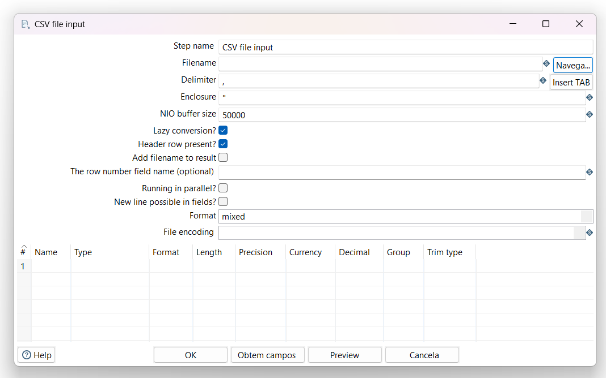

Com certeza. O step **CSV file input** é um dos mais utilizados no Pentaho e possui configurações cruciais para garantir que os dados sejam lidos corretamente e com boa performance.

Abaixo, detalho o que cada campo e opção dessa tela faz, divididos por categorias para facilitar o entendimento:

### Configurações Básicas de Origem

* **Step name:** O nome do step dentro da sua Transformation. É uma boa prática dar nomes descritivos (ex: `CSV file input - Clientes`).
* **Filename:** O caminho completo onde o arquivo CSV está salvo. O botão "Navegar..." ajuda a localizar o arquivo no seu computador ou servidor.
* **Delimiter:** O caractere que separa as colunas no seu arquivo. O padrão é a vírgula (`,`), mas no Brasil é muito comum usarmos o ponto e vírgula (`;`) ou até mesmo o *Tab* (usando o botão "Insert TAB").
* **Enclosure:** O caractere usado para "empacotar" um texto que possa conter o delimitador dentro dele. Geralmente são aspas duplas (`"`). *Exemplo: Se o delimitador é vírgula e um campo de endereço é `"Rua ABC, 123"`, o enclosure garante que a vírgula dentro das aspas não quebre a coluna.*

### Performance e Otimização

* **NIO buffer size:** O tamanho da memória (em bytes) alocada para ler o arquivo em blocos. O valor padrão de `50000` costuma atender bem, mas pode ser aumentado para arquivos gigantescos visando ganhar velocidade de leitura.
* **Lazy conversion?:** Uma das opções mais importantes para performance. Se marcada, o Pentaho não converte os dados do CSV (que nascem como texto) para seus tipos finais (Integer, Date, etc.) imediatamente na leitura. Ele os mantém em um formato binário bruto e só faz a conversão mais para frente no fluxo, caso algum step exija (como um cálculo ou filtro). Se o dado for apenas passar reto do CSV para um banco de dados, deixar isso marcado economiza muito processamento.

### Estrutura e Comportamento da Leitura

* **Header row present?:** Indica se a primeira linha do seu arquivo é o cabeçalho com o nome das colunas. Se desmarcado, o PDI vai tratar a primeira linha já como dado.
* **Add filename to result:** Se marcado, cria uma nova coluna no fluxo de dados contendo o caminho e o nome do arquivo de origem. Muito útil quando você está lendo múltiplos CSVs de uma pasta e precisa rastrear de qual arquivo cada linha veio.
* **The row number field name (optional):** Se você preencher um nome aqui (ex: `numero_linha`), o PDI criará uma coluna no seu fluxo enumerando cada linha lida (1, 2, 3...).
* **Running in parallel?:** Usado quando você tem um arquivo CSV massivo. Se marcado, permite que múltiplas instâncias (cópias) desse mesmo step leiam partes diferentes do arquivo ao mesmo tempo. *Nota: Geralmente exige configuração adicional no step para definir o número de cópias.*
* **New line possible in fields?:** Marque isso **apenas** se você tiver colunas de texto longo (como campos de observação ou comentários) que contenham "Enters" (quebras de linha) dentro do próprio texto. Se não marcar isso e houver quebras, o Pentaho achará que é uma nova linha de registro e vai quebrar os dados. *Atenção: Marcar isso deixa a leitura do arquivo consideravelmente mais lenta.*
* **Format:** Define o padrão de quebra de linha do sistema operacional onde o arquivo foi gerado (`DOS`, `UNIX` ou `mixed`). Na dúvida, `mixed` lida bem com a maioria.
* **File encoding:** A codificação de caracteres do arquivo. Extremamente importante para evitar problemas com acentuação (ç, á, ã). Os mais comuns são `UTF-8` ou `ISO-8859-1` / `Windows-1252`.

### Grade Inferior (Mapeamento das Colunas)

Esta é a tabela onde o PDI "tipa" os dados que estão entrando.

* **Name:** O nome da coluna.
* **Type:** O tipo de dado no Pentaho (String, Integer, Number, Date, Boolean, etc.).
* **Format:** A máscara do dado. Essencial para Datas (ex: `yyyy-MM-dd`) ou Números (ex: `#.#,00`).
* **Length / Precision:** Tamanho do campo e casas decimais.
* **Currency / Decimal / Group:** Símbolos usados para formatação financeira, separador decimal e agrupador de milhares (importante configurar se o arquivo usa `,` ou `.` para decimais).
* **Trim type:** Permite limpar espaços em branco indesejados automaticamente (à esquerda, à direita ou ambos).

**Dica de Ouro:** Dificilmente você precisa preencher essa grade inferior na mão. Basta preencher o caminho do arquivo, o delimitador, e clicar no botão **Obtem campos** (Get Fields) lá embaixo. O PDI vai ler uma amostra do arquivo e tentar adivinhar o nome, o tipo e o formato de cada coluna automaticamente. Depois, você clica em **Preview** para garantir que a leitura ficou perfeita!

## Text File

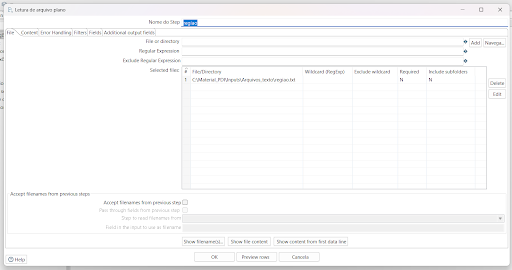

Excelente adição para a sua apostila! O step **Text file input** (na sua imagem traduzido como *Leitura de arquivo plano*) é o grande "coringa" do Pentaho.

Embora o *CSV file input* (que vimos primeiro) seja mais rápido e otimizado especificamente para CSVs simples, este step de Arquivo Plano é muito mais flexível. Ele permite ler arquivos delimitados (separados por vírgula, ponto e vírgula, tabulação) e também arquivos de **tamanho fixo** (fixed-width, onde cada coluna tem uma quantidade exata de caracteres, muito comum em arquivos de sistemas bancários antigos ou Mainframes).

A aba **File** deste step funciona de forma quase idêntica à do Excel. Vamos ao detalhamento:

---

### Aba "File" (Seleção de Arquivos de Texto)

#### 1. Configuração Básica

* **Nome do Step:** O nome da etapa no seu fluxo (no seu caso, `regiao`).

#### 2. Seleção de Arquivos (File or directory)

* **File or directory:** O caminho onde o seu arquivo `.txt`, `.csv` ou `.dat` está. Assim como no Excel, **é obrigatório clicar no botão "Add"** para que o arquivo vá para a lista de baixo.
* **Regular Expression (Wildcard):** Expressão regular para ler múltiplos arquivos de uma pasta. *Exemplo: Se você recebe um arquivo por dia e quer ler todos de uma vez, pode apontar para a pasta e colocar `.*\.txt` aqui.*
* **Exclude Regular Expression:** Expressão regular para ignorar arquivos específicos (ex: ignorar um arquivo chamado `leia-me.txt` que esteja no meio dos dados).

#### 3. Tabela de Arquivos Selecionados (Selected files)

No seu print, já vemos o arquivo `C:\Material_PDI\Inputs\Arquivos_texto\regiao.txt` adicionado.

* **Required (N/Y):** Se estiver como `Y` (Sim) e o arquivo não existir na pasta, o Pentaho gera um erro fatal e para. Se `N` (Não), ele ignora e segue o fluxo vazio.
* **Include subfolders (N/Y):** Se buscará arquivos em subpastas.

#### 4. Leitura Dinâmica (Accept filenames from previous steps)

Igual ao Excel, serve para automação avançada, recebendo o nome do arquivo de um passo anterior.

* **Accept filenames from previous step:** Ativa a leitura dinâmica.
* **Pass through fields from previous step:** *[Diferencial deste step]* Se ativado, além de ler o arquivo de texto, o Pentaho vai "carregar" junto as colunas que vieram do step anterior e juntar com os dados lidos do texto.
* **Step / Field:** Define de onde vem a informação do caminho do arquivo.

#### 5. Botões de Visualização Inferiores (Diferenciais)

Estes botões são excelentes aliados para investigar o arquivo antes mesmo de configurar o resto:

* **Show filename(s)...:** Mostra uma lista de todos os arquivos que o Pentaho conseguiu encontrar com base nas suas configurações da grade.
* **Show file content:** Abre uma janelinha mostrando o texto bruto do arquivo selecionado. Ótimo para você descobrir qual é o delimitador que está sendo usado ou se o arquivo tem algum lixo no cabeçalho.
* **Show content from first data line:** Mostra o arquivo ignorando o cabeçalho (útil para ver direto os dados).

---

### Resumo das Outras Abas (Para a sua Apostila)

Como este step é o mais versátil para arquivos de texto, as outras abas são fundamentais:

* **Aba `Content` (Conteúdo):** É aqui que a mágica da formatação acontece. Você vai definir se o tipo de arquivo é **CSV** (delimitado) ou **Fixed** (tamanho fixo). Também é aqui que você define o delimitador (se for o caso), a codificação (*Encoding* como UTF-8) e se tem cabeçalho.
* **Aba `Error Handling` (Tratamento de Erros):** Permite configurar o que fazer se o Pentaho encontrar uma linha corrompida (ex: uma letra onde deveria ter um número). Em vez de quebrar tudo, você pode mandar os erros para um arquivo `.txt` de log separado.
* **Aba `Filters` (Filtros):** Permite pular linhas inteiras do arquivo que contenham uma palavra específica. Útil para limpar arquivos que vêm com "rodapés" inúteis gerados por sistemas legados.
* **Aba `Fields` (Campos):** A grade onde ficam os nomes das colunas e os tipos de dados (String, Date, Number). Assim como no CSV, você usará o botão "Obter Campos" para o Pentaho preencher isso automaticamente para você.

## Microsoft Excel

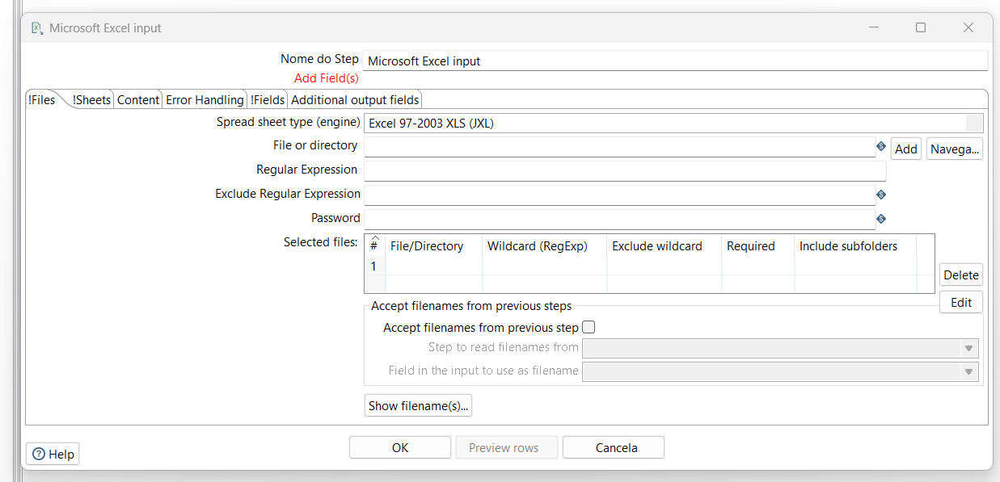

Como o Excel é um arquivo mais complexo (pode ter várias planilhas/abas internas e formatos diferentes), esse step é dividido em várias abas (`Files`, `Sheets`, `Content`, etc.).

A imagem que você mandou mostra a aba principal: **Files**. Vamos destrinchar o que cada campo faz nela, e depois te dou um resumo rápido das outras abas para sua apostila ficar completa!

---

### Aba "Files" (Seleção e Configuração dos Arquivos)

Esta aba é focada exclusivamente em dizer ao PDI **quais** arquivos Excel ele deve ler e **como** ele deve abrir (qual motor usar).

#### 1. Configurações Básicas e Motor (Engine)

* **Nome do Step:** Assim como no CSV, é o nome descritivo do passo no seu fluxo (ex: `Excel Input - Vendas Mensais`).
* **Spread sheet type (engine):** **[MUITO IMPORTANTE]** O Excel mudou muito ao longo dos anos. Aqui você diz ao PDI qual "motor" (biblioteca Java) usar para ler o arquivo:
* *Excel 97-2003 XLS (JXL):* Use apenas para arquivos antigos (`.xls`).
* *Excel 2007 XLSX (Apache POI):* Use para arquivos modernos (`.xlsx`). Ele carrega o arquivo na memória RAM, então é rápido, mas pode dar erro de falta de memória (*Out of Memory*) se o Excel for gigantesco.
* *Excel 2007 XLSX (Apache POI Streaming):* Use para arquivos `.xlsx` **muito grandes**. Ele lê o arquivo em blocos, economizando muita memória RAM, mas pode ser um pouquinho mais lento e tem algumas limitações com formatação complexa.

* **Password:** Se a sua planilha Excel for protegida por senha, é aqui que você a insere para que o PDI consiga abri-la.

#### 2. Seleção de Arquivos (File or directory)

Diferente do CSV, o step do Excel permite ler dezenas de arquivos de uma vez só de uma pasta.

* **File or directory:** Você usa o botão "Navegar..." para achar o arquivo ou a pasta. **Atenção:** Apenas preencher o caminho aqui não faz o PDI ler o arquivo. Você **precisa clicar no botão "Add"** para que o arquivo desça para a tabela "Selected files" (veja abaixo).
* **Regular Expression (Wildcard):** Se você selecionou uma *pasta* em vez de um arquivo, você pode usar uma Expressão Regular para ler vários arquivos de uma vez. *Exemplo: `.*\.xlsx` vai ler todos os arquivos XLSX dentro daquela pasta.*
* **Exclude Regular Expression:** O oposto do item acima. Útil para ignorar arquivos específicos numa pasta (ex: ignorar arquivos que comecem com "bkp_").

#### 3. Tabela de Arquivos Selecionados (Selected files)

É aqui que a "mágica" acontece. **O PDI só vai ler o que estiver listado nesta grade.**

* **File/Directory:** O caminho que foi adicionado.
* **Wildcard / Exclude wildcard:** As regras de inclusão/exclusão (se você adicionou uma pasta).
* **Required:** Se estiver marcado como `Y` (Yes) e o PDI não encontrar o arquivo na hora de rodar, o pipeline dá erro e para. Se estiver `N` (No), ele apenas ignora e continua o fluxo.
* **Include subfolders:** Se você adicionou uma pasta, marca se o PDI deve vasculhar dentro das subpastas atrás de mais arquivos Excel.

#### 4. Leitura Dinâmica (Accept filenames from previous steps)

Esta é uma funcionalidade **avançada e essencial** para pipelines profissionais.

* **Accept filenames from previous step:** Se você marcar essa caixinha, a grade "Selected files" é ignorada. Em vez disso, o step vai esperar que o caminho do arquivo venha de um step anterior através de uma "seta" (hop).
* **Step to read filenames from:** Qual step anterior está enviando os nomes dos arquivos (ex: um step "Get File Names" ou uma consulta num banco de dados).
* **Field in the input to use as filename:** Qual é o nome da coluna (campo) que está chegando e que contém o caminho completo do arquivo Excel.
* *Para que serve?* Imagine que você tem uma tabela no banco de dados com a lista de relatórios que precisam ser processados hoje. Você lê essa tabela e passa os caminhos dinamicamente para o Excel Input.

---

### Resumo das Outras Abas (Para sua Apostila)

Como o Excel tem peculiaridades, você vai precisar navegar pelas outras abas antes de clicar em OK:

* **Aba `Sheets` (Planilhas):** Onde você define quais "abas" do seu arquivo Excel (ex: Plan1, Plan2, ou "Resumo") serão lidas. Você precisa adicionar o nome das sheets que quer processar.
* **Aba `Content` (Conteúdo):** Onde você diz se o arquivo tem cabeçalho (*Header*), se quer ignorar linhas em branco (*Strict types*) ou limitar o número de linhas lidas (*Limit*).
* **Aba `Fields` (Campos):** Exatamente igual à grade inferior do CSV. Onde você clica em "Obter campos" (Get fields from header row) para o PDI mapear as colunas, dizer se é String, Number, Date, etc.

**Dica de Ouro para sua Apostila:** Se o PDI estiver fechando sozinho ou dando erro de Java ao ler um arquivo `.xlsx` grande, volte na aba "Files" e mude a Engine para **"Apache POI Streaming"**. Isso resolve 99% dos problemas de gargalo de memória com Excel!

## Dummy

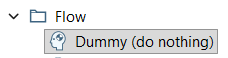

O step **Dummy (do nothing)** é um dos mais curiosos do Pentaho porque, como o próprio nome e a descrição dizem, ele **não faz absolutamente nada** com os dados. Ele apenas recebe as linhas e as passa para o próximo step exatamente do jeito que chegaram.

Mas se ele não altera os dados, por que ele é tão utilizado por profissionais de dados?

Aqui estão os **4 principais motivos** para você usar o Dummy no seu dia a dia:

### 1. Ponto de Encontro (Organização de Fluxo)

Esta é a função número um do Dummy. Imagine que você está lendo dados de 3 arquivos Excel diferentes e quer aplicar a mesma transformação em todos eles (por exemplo, deixar todos os nomes em maiúsculo).
Em vez de criar três steps de transformação iguais, você liga a saída dos 3 arquivos Excel em um único step **Dummy**. Depois, liga o Dummy no step de transformação. Ele age como um funil ou rotatória, organizando o trânsito e deixando seu fluxo visualmente limpo.

### 2. O Caminho do "Lixo" (Sink / Fim da Linha)

Quando você usa steps de decisão, como o **Filter Rows** (Filtrar Linhas), você é obrigado a dizer para onde vão as linhas que passaram no filtro (Verdadeiro) e as linhas que foram barradas (Falso).
Se você só se importa com as linhas Verdadeiras e quer simplesmente descartar as Falsas, você aponta a seta do Falso para um step **Dummy**. Ele servirá como um "ralo" ou "lixeira" segura para onde esses dados vão e morrem, sem dar erro no fluxo.

### 3. Ponto Seguro para Testes (Preview)

Muitas vezes, enquanto estamos desenvolvendo, queremos ver como os dados estão ficando antes de enviá-los de fato para o Banco de Dados final (Insert/Update).
Para evitar gravar dados errados por acidente durante os testes, os desenvolvedores colocam um **Dummy** no final da linha provisoriamente. Assim, você pode clicar nele e usar o "Preview" tranquilamente, sabendo que os dados não estão indo para lugar nenhum ainda.

### 4. Esqueleto do Projeto (Placeholder)

Às vezes você sabe que o dado precisará passar por uma validação complexa, mas você ainda não sabe como fazer isso ou está esperando uma regra de negócio do seu chefe. Você pode colocar um **Dummy** lá com o nome "Validar CPF futuramente", apenas para desenhar o fluxo completo e deixar aquele "espaço reservado" para ser substituído pelo step correto depois.

---

**Resumo para a Apostila 📝:**
Pense no step **Dummy** como um "cone de trânsito" organizador. Ele não altera a carga, não muda a velocidade e não transforma nada, mas é essencial para organizar as rotas dos seus dados, unir caminhos e criar pontos seguros de parada!


# Select Value

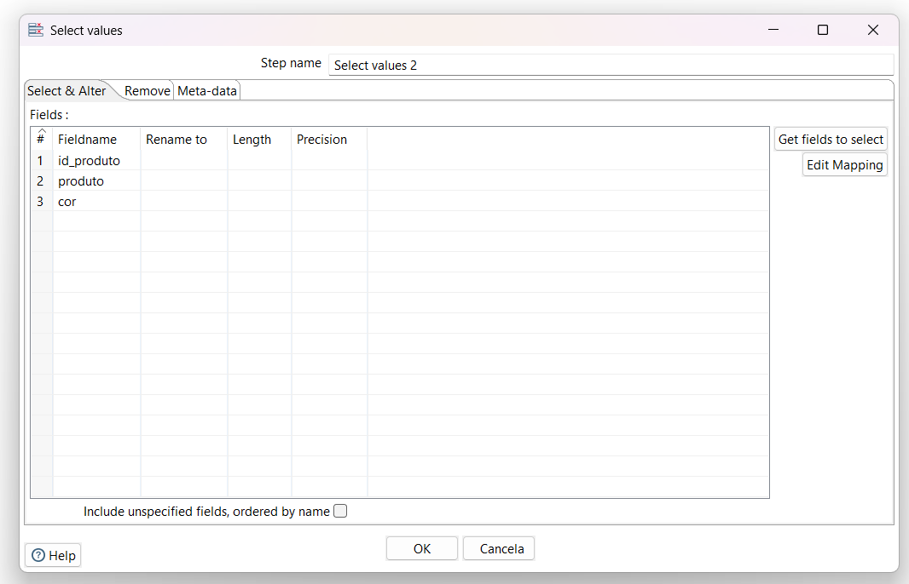

### 1. Aba "Select & Alter" (Selecionar, Renomear e Reordenar)

Esta é a aba que aparece no seu print. O objetivo principal dela é definir **quais colunas vão continuar no fluxo**, **qual a ordem delas** e **se elas terão um novo nome**.

* **Fieldname:** O nome original da coluna que está chegando do step anterior (ex: `id_produto`).
* **Rename to:** Se você quiser renomear a coluna, digite o novo nome aqui. Se deixar em branco, o nome original é mantido.
* **Length / Precision:** Permite alterar o tamanho e as casas decimais do campo. *(Dica: Geralmente é melhor fazer isso na aba "Meta-data", que é mais completa).*
* **Botão "Get fields to select":** Clicando aqui, o PDI preenche a grade automaticamente com todas as colunas que estão vindo do step anterior. É o ponto de partida padrão.
* **A ordem importa:** A ordem em que as colunas aparecem nesta grade será a ordem exata em que elas sairão para o próximo step. Você pode selecionar uma linha e usar as setas do teclado (ou atalhos de mover para cima/baixo) para reordenar seu dataset.
* **Include unspecified fields, ordered by name (Caixa de seleção):** * *Se desmarcada (padrão):* O PDI vai **deletar** do fluxo qualquer coluna que não esteja listada na grade.
* *Se marcada:* O PDI vai manter as colunas que você listou na grade (com as alterações que você fez) e vai adicionar no final todas as outras colunas que vieram do step anterior (em ordem alfabética).


---

### 2. Aba "Remove" (Remover Colunas)

O objetivo desta aba é simples e direto: **excluir colunas do fluxo**.

* **Por que usar esta aba em vez da primeira?** Imagine que você tem uma tabela com 100 colunas chegando, e você só quer excluir 2 (ex: `senha` e `token`).
Em vez de ir na primeira aba, listar as 98 colunas que você quer manter (o que daria trabalho e deixaria o step gigante), você vem na aba **Remove** e lista apenas as 2 colunas que quer deletar. O PDI deixará as outras 98 passarem intactas.
* **Name:** Basta colocar o nome da coluna que deve ser eliminada. Você também pode usar o botão "Get fields to remove" e apagar da lista as que você quer manter.

---

### 3. Aba "Meta-data" (Metadados - Alteração de Tipagem)

Esta é indiscutivelmente a aba mais poderosa deste step. Ela serve para **converter tipos de dados e formatos**. Se um dado entrou como Texto (String) e você precisa que ele vire Data (Date) ou Número (Integer/Number) para inserir no banco de dados, é aqui que você configura.

* **Fieldname:** O nome da coluna que você quer alterar.
* **Rename to:** Permite renomear a coluna ao mesmo tempo em que muda o tipo.
* **Type:** O novo tipo de dado que a coluna deve assumir (String, Integer, Number, Date, Boolean, etc.).
* **Format:** A máscara de conversão.
* *Exemplo para Datas:* Se a sua string é `2023-12-31`, o format deve ser `yyyy-MM-dd`.
* *Exemplo para Números:* `#.#,00`.


* **Length / Precision:** O novo tamanho do campo no banco (ex: um VARCHAR(50) se torna Length 50).
* **Currency / Decimal / Grouping:** Símbolos usados caso esteja convertendo números financeiros (ex: definir que o separador de milhar é `.` e o decimal é `,`).
* **Trim type:** Permite limpar espaços em branco indesejados (à esquerda, à direita ou ambos) durante a conversão.

---

### ⚠️ Dica de Ouro (Boas Práticas de PDI)

Nunca misture o uso da aba **Select & Alter** com a aba **Remove** no mesmo step.
O motor do Pentaho pode se confundir sobre a ordem de execução (se ele seleciona primeiro ou remove primeiro) e gerar bugs inexplicáveis no fluxo ou colunas duplicadas.

**A regra é clara:**

* Se o objetivo for **manter/renomear/reordenar**, use a aba 1 e deixe a aba 2 vazia.
* Se o objetivo for **apenas excluir** algumas colunas de um dataset grande, use a aba 2 e deixe a aba 1 vazia.
* A aba 3 (**Meta-data**) pode ser usada junto com qualquer uma das outras sem problemas!

---

# Split fields

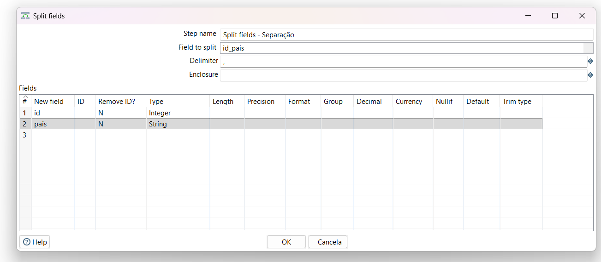

O **Split fields** (Dividir campos) é o step perfeito para quando você recebe dados "espremidos" em uma única coluna e precisa separá-los em colunas diferentes.

No exemplo da sua imagem, você tem um campo chamado `id_pais` que provavelmente contém dados no formato `1,Brasil` ou `2,Argentina`. O objetivo do step é exatamente quebrar isso no meio e gerar duas colunas limpas: `id` e `pais`.

Vamos detalhar cada opção dessa tela:

### 1. Configurações Principais (Cabeçalho)

* **Step name:** O nome da etapa (no seu caso, `Split fields - Separação`).
* **Field to split:** É a coluna de origem, ou seja, o campo que contém o texto agrupado que você deseja dividir (no seu print, `id_pais`).
* **Delimiter:** O caractere "separador" que o Pentaho usará como ponto de corte. No seu caso é a vírgula (`,`), mas poderia ser um traço (`-`), um ponto e vírgula (`:`), uma barra (`|`) ou até mesmo um espaço em branco.
* **Enclosure:** O caractere usado para "proteger" um texto que possa conter o delimitador dentro dele (geralmente aspas duplas `"`). *Exemplo: Se você está dividindo por vírgula e o texto é `1,"Coreia, Sul"`, o enclosure garante que a vírgula dentro de "Coreia, Sul" não seja interpretada como um ponto de corte.*

### 2. Grade de Separação (Fields)

É aqui que você define como as novas colunas vão se chamar e qual será o tipo de dado de cada "pedaço" cortado. A ordem em que você insere as linhas aqui **deve ser a mesma ordem** em que os dados aparecem no texto original.

* **New field:** O nome da nova coluna que será criada (ex: `id` e `pais`).
* **ID & Remove ID? (Avançado):** Isso é usado apenas se o seu texto estiver no formato de "chave=valor" (ex: `codigo=10, nome=Brasil`). Você poderia colocar `codigo=` no campo ID e marcar `Y` no Remove ID. O Pentaho iria procurar esse prefixo e extrair apenas o número 10. Para o uso comum (que é o seu caso), deixe isso em branco.
* **Type:** O tipo de dado da nova coluna. Note que o Pentaho já faz a conversão para você! O seu `id` já vai nascer como **Integer** (Número Inteiro) e o `pais` como **String** (Texto).
* **Length / Precision / Format / Group / Decimal / Currency:** Igual à aba Meta-data do *Select Values*. Serve para formatar e definir o tamanho dos dados gerados, especificar formato de datas ou símbolos monetários.
* **Nullif:** Se o "pedaço" extraído for exatamente igual à palavra que você digitar aqui, o Pentaho vai transformar aquele valor em nulo (`NULL`). *Útil se o arquivo vier com algo como "N/A" e você quiser que o banco de dados receba nulo.*
* **Default:** O valor padrão. Se a divisão falhar porque não havia dados suficientes após o delimitador, o Pentaho preencherá a coluna com o valor que você colocar aqui (ex: "Desconhecido").
* **Trim type:** Fundamental! Como a divisão de textos frequentemente deixa espaços em branco sobrando no começo ou no final da palavra, você usa isso para limpar o dado automaticamente (opções: *left*, *right* ou *both* - esquerda, direita ou ambos).

---

### ⚠️ Regras de Comportamento e Boas Práticas (Para a Apostila)

1. **O campo original não é deletado:** Após passar por este step, o seu fluxo terá as colunas `id`, `pais` **E** a coluna original `id_pais`. Se você não quiser mais a original, precisará usar um step *Select values* (aba Remove) logo na sequência para apagá-la.
2. **O que acontece se faltar delimitador?** Se o Pentaho ler a string `1` (sem vírgula e sem o país), a coluna `id` receberá o número 1 e a coluna `pais` ficará nula (ou receberá o valor *Default*, se configurado).
3. **O que acontece se sobrar delimitador?** Se o Pentaho ler a string `1,Brasil,América do Sul` e você só configurou 2 linhas na grade, o Pentaho vai ler o `1`, vai ler o `Brasil` e **vai ignorar** o resto da frase. O "América do Sul" será descartado do fluxo.

---

# Concat fields

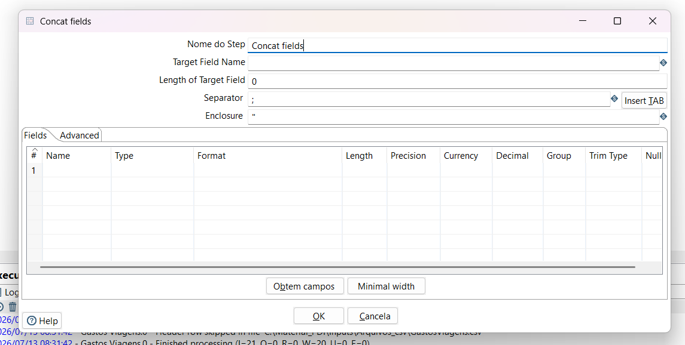

Ótima adição! Se no passo anterior nós vimos o *Split fields* (que "quebra" uma coluna em várias), o **Concat fields** é exatamente o seu oposto: ele pega várias colunas separadas e as "cola" (concatena) em uma única coluna nova.

É um step extremamente útil para montar chaves compostas, criar endereços completos (juntando rua, número e bairro) ou formatar mensagens de texto dinâmicas.

Vamos destrinchar as opções dessa tela para a sua apostila:

### 1. Configurações Principais (Cabeçalho)

* **Nome do Step:** O nome da etapa no seu fluxo (ex: `Concat fields - Endereço Completo`).
* **Target Field Name:** **[Obrigatório]** Aqui você digita o nome da **nova coluna** que será criada para guardar o resultado da junção. (Ex: se você vai juntar `nome` e `sobrenome`, o target field pode ser `nome_completo`).
* **Length of Target Field:** O tamanho máximo de caracteres dessa nova coluna. Deixar em `0` (como na imagem) significa que o Pentaho não vai impor um limite de tamanho na memória, o que costuma ser a melhor opção para não cortar dados acidentalmente.
* **Separator:** O caractere ou texto que vai ficar **entre** os campos que estão sendo juntados.
* *Exemplo:* Se você juntar `Rua A` e `123` com o separador `-`, o resultado será `Rua A-123`. Se quiser um espaço em branco, basta digitar um espaço ali.


* **Enclosure:** Assim como nos arquivos, é o caractere usado para "empacotar" o texto final. Deixar em branco ou com aspas duplas (`"`) depende de como o sistema de destino espera receber esse dado.

### 2. Aba "Fields" (Campos a serem juntados)

A ordem em que as colunas aparecem nesta grade é a ordem exata em que elas serão coladas da esquerda para a direita.

* **Name:** O nome das colunas de origem que você quer juntar.
* **Type / Format:** É aqui que a ferramenta brilha. Você pode formatar o dado **antes** de ele ser colado. Se você for colar uma data com um texto, pode definir o *Type* como Date e o *Format* como `dd/MM/yyyy`. O Pentaho formata e depois junta tudo como texto.
* **Length / Precision / Currency / Decimal / Group:** Permite formatar números (ex: adicionar separador de milhar) antes da concatenação.
* **Trim Type:** Extremamente importante aqui! Como você está colando palavras, qualquer espaço vazio sobrando no final de um campo vai criar "buracos" no texto final. Usar o Trim `both` garante que as palavras fiquem limpas antes de serem unidas pelo separador.
* **Null:** O que o Pentaho deve escrever no texto final se aquela coluna específica estiver vazia (nula). Se você não colocar nada, e a coluna for nula, ele simplesmente não coloca nada na junção.
* **Botão "Obtem campos":** Puxa todas as colunas do fluxo para a grade. Muito útil para não ter que digitar os nomes na mão; você clica aqui e depois só deleta as linhas que não quer juntar.
* **Botão "Minimal width":** O Pentaho tenta calcular o tamanho mínimo necessário para os campos com base na amostra de dados.

### 3. Aba "Advanced" (Avançado - Oculta no print)

Para a sua apostila ficar completa, vale mencionar que a aba **Advanced** possui duas opções valiosíssimas:

* **Remove selected fields:** Se você marcar essa caixinha, o Pentaho vai deletar as colunas originais do fluxo após criar a coluna concatenada. *Exemplo: Ele cria o `nome_completo` e já apaga automaticamente as colunas velhas `nome` e `sobrenome`, poupando você de ter que usar um step Select Values para removê-las depois.*
* **Force the enclosure symbol:** Força o uso das aspas (ou o caractere de enclosure) mesmo quando não for estritamente necessário.

---

### ⚠️ Dica de Ouro (Boas Práticas de PDI)

Existem duas formas principais de juntar textos no Pentaho: usando o **Concat fields** ou usando o step **Calculator** (com a função A + B + C).

* **Quando usar o Concat Fields?** Quando você tem um separador padrão entre todos os campos (ex: separar tudo por vírgula) ou quando quer juntar muitos campos de uma vez só. É mais visual e fácil de dar manutenção.
* **Quando usar o Calculator?** Quando a junção for muito simples (apenas dois campos sem separador complexo) ou quando o volume de dados for absurdamente gigantesco, pois o motor do Calculator costuma ser levemente mais rápido em processamentos brutos de CPU.

---

# Sort Rows

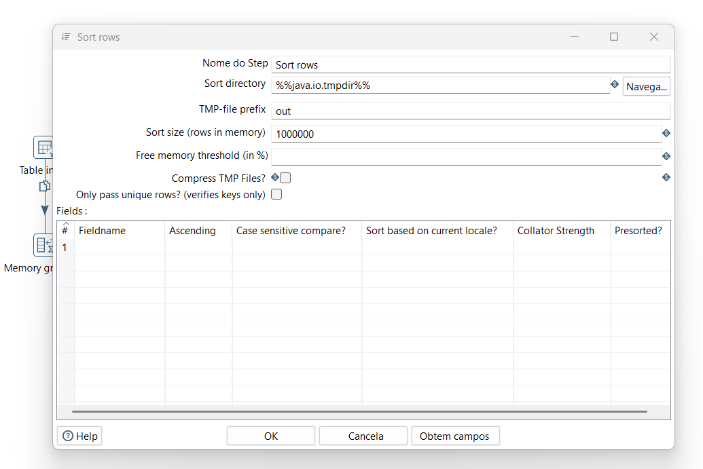

O **Sort rows** (Ordenar linhas) é um dos steps mais importantes e, ao mesmo tempo, um dos mais "perigosos" para a performance do seu fluxo se não for bem compreendido.

Para a sua apostila, a primeira coisa que você precisa anotar sobre ele é: **ele é um step bloqueador (blocking step)**. Isso significa que ele precisa esperar *todas* as linhas chegarem do step anterior, organizar tudo na memória, para só então começar a liberar os dados para o próximo step.

Vamos destrinchar cada configuração da tela que você enviou:

### 1. Configurações de Memória e Arquivos Temporários

Como ordenar milhões de linhas exige muita memória RAM, o Pentaho possui um mecanismo inteligente de "transbordo" para o disco rígido caso a memória fique cheia.

* **Nome do Step:** O nome do passo no seu fluxo (ex: `Ordenar por Data`).
* **Sort directory:** O diretório (pasta) onde o Pentaho vai criar arquivos temporários caso precise escrever no disco. O padrão `%%java.io.tmpdir%%` aponta para a pasta de arquivos temporários do seu sistema operacional.
* **TMP-file prefix:** O prefixo do nome desses arquivos temporários (o padrão é `out`, então os arquivos se chamarão algo como `out12345.tmp`).
* **Sort size (rows in memory):** **[MUITO IMPORTANTE]** É o limite de linhas que o Pentaho vai segurar na memória RAM antes de começar a gravar no disco. O padrão é 1.000.000 (um milhão). Se as suas linhas tiverem muitas colunas de texto longo, um milhão pode estourar sua memória (gerando o famoso erro *Out of Memory*). Se isso acontecer, você deve **diminuir** esse valor (ex: para 100000).
* **Free memory threshold (in %):** Uma alternativa ao campo de cima. Em vez de definir uma quantidade exata de linhas, você define um percentual mínimo de memória RAM livre. Se a memória livre do servidor cair abaixo desse percentual (ex: 20%), ele começa a gravar no disco.
* **Compress TMP Files?:** Se marcado, o Pentaho vai compactar (zipar) os arquivos temporários no disco. Isso economiza espaço no HD, mas consome mais processador. Só use se o seu servidor tiver muito pouco espaço em disco.

### 2. Comportamento Especial

* **Only pass unique rows? (verifies keys only):** Se você marcar essa caixinha, o step passa a funcionar como um `SELECT DISTINCT` do SQL. Ele vai remover as linhas duplicadas, entregando apenas uma versão de cada. **Atenção:** ele considera como "duplicada" apenas as colunas que você listou na grade de ordenação abaixo, e não a linha inteira.

### 3. Grade de Campos (Fields)

É aqui que você define a regra da ordenação. Você pode adicionar várias colunas (ex: ordenar primeiro por `Estado` e depois por `Cidade`).

* **Fieldname:** O nome da coluna que será usada para ordenar.
* **Ascending:** `Y` (Sim) ordena de forma Crescente (A a Z, 0 a 9). `N` (Não) ordena de forma Decrescente (Z a A, 9 a 0).
* **Case sensitive compare?:** Se `Y`, letras maiúsculas e minúsculas são tratadas de forma diferente na hora de organizar (ex: "Zebra" pode vir antes de "abacate"). Se `N`, ele ignora a diferença entre maiúsculas e minúsculas.
* **Sort based on current locale?:** Se `Y`, ele usa as regras de idioma do seu sistema operacional. Isso é fundamental no Brasil para que palavras com acento (á, ç, ã) sejam ordenadas corretamente junto com as letras normais.
* **Collator Strength:** Uma configuração avançada de idioma (Primária, Secundária, etc.) que define o quão rigorosa será a comparação de acentos e símbolos. Geralmente deixamos em branco para usar o padrão.
* **Presorted?:** Se você sabe que os dados que estão chegando já estão parcialmente ordenados por essa coluna, você marca `Y`. Isso avisa o Pentaho para pular uma etapa de organização interna, deixando o processo um pouco mais rápido.

---

### ⚠️ Dicas de Ouro e Boas Práticas (Para a Apostila)

1. **Sempre que possível, ordene no Banco de Dados:** Se a origem dos seus dados for um *Table Input* (banco de dados relacional), é **muito mais rápido e eficiente** colocar um `ORDER BY` na sua query SQL do que usar o step *Sort rows* no Pentaho. Use este step apenas quando os dados vierem de arquivos (Excel, CSV) ou quando você misturar dados de fontes diferentes.
2. **Pré-requisito obrigatório:** No Pentaho, os steps **Merge Join** (Juntar fluxos) e **Group By** (Agrupar/Totalizar) exigem que os dados cheguem até eles previamente ordenados. Portanto, o *Sort rows* é o melhor amigo (e parceiro inseparável) desses dois steps! Utilizar o botão "Obtem campos" ajuda a preencher a grade rapidamente com as chaves necessárias.

---

# Group By

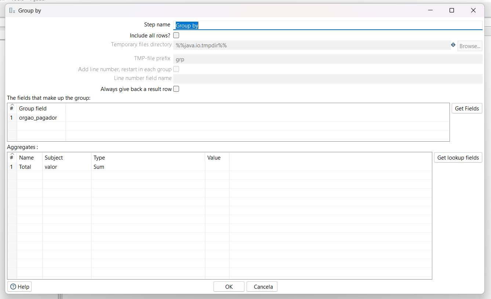

Para completar a dupla dinâmica com o *Sort rows*, temos o **Group by** (Agrupar por). Este é o step que você vai usar sempre que precisar fazer totalizações, como somar valores, contar registros, tirar médias ou achar o maior/menor valor de um conjunto de dados.

Na sua apostila, **a regra mais importante deste step deve estar em negrito e com marca-texto:**
**⚠️ O step "Group by" EXIGE que os dados cheguem até ele previamente ordenados pelos mesmos campos que você vai usar para agrupar.** Se os dados não passarem por um *Sort rows* (ou já virem ordenados do banco) antes de entrar aqui, os totais ficarão completamente errados.

Vamos detalhar cada bloco da tela da sua imagem:

### 1. Configurações Principais (Cabeçalho)

* **Step name:** O nome da etapa (ex: `Group by`).
* **Include all rows? (Incluir todas as linhas?):** Esta é uma opção fantástica. Normalmente, um agrupamento "esmaga" os dados (ex: 100 vendas de um órgão pagador viram apenas 1 linha com o total). Se você marcar esta caixa, o Pentaho **mantém as 100 linhas originais** e apenas adiciona uma nova coluna no final de cada uma delas contendo o valor total.
* **Temporary files directory / TMP-file prefix:** Assim como no *Sort rows*, se você usar a opção acima ("Include all rows") com milhões de registros, o Pentaho pode precisar usar o disco rígido (arquivos temporários) para não estourar a memória RAM. O padrão é a pasta temp do sistema (`%%java.io.tmpdir%%`).
* **Add line number, restart in each group:** Cria uma nova coluna contando as linhas (1, 2, 3...) e zera o contador toda vez que o grupo muda. *Só funciona se a opção "Include all rows" estiver marcada.*
* **Line number field name:** Se você marcou a caixinha acima, aqui você digita o nome da coluna que vai receber essa contagem (ex: `ranking_venda`).
* **Always give back a result row:** Se o step anterior não enviar nenhuma linha (fluxo vazio), o padrão do *Group by* é não gerar nada. Se você marcar isso, ele vai forçar a saída de pelo menos uma linha com valores nulos ou zerados. Útil para não quebrar lógicas de relatórios que esperam sempre receber algo.

### 2. Grade Superior: The fields that make up the group (Chaves de Agrupamento)

Equivale ao `GROUP BY` da linguagem SQL. É aqui que você define qual é o "nível" do seu resumo.

* **Group field:** A coluna (ou colunas) que define o grupo. No seu exemplo, você escolheu `orgao_pagador`. Isso significa que o Pentaho vai gerar uma linha de totalizador para cada Órgão Pagador diferente que ele encontrar.
* **Botão "Get Fields":** Puxa os campos do step anterior para facilitar o preenchimento.

### 3. Grade Inferior: Aggregates (Agregações e Cálculos)

Aqui é onde você define **o que** será calculado para cada grupo criado na grade superior.

* **Name:** O nome da nova coluna que será criada com o resultado do cálculo. No seu print, você chamou de `Total`.
* **Subject:** A coluna original que contém os dados que serão calculados. No seu caso, a coluna `valor`.
* **Type:** O tipo de operação matemática ou lógica. No seu exemplo, é um `Sum` (Soma). Mas existem dezenas de opções aqui, sendo as mais comuns:
* *Count all:* Conta quantas linhas existem no grupo.
* *Average:* Tira a média.
* *Minimum / Maximum:* Pega o menor ou maior valor do grupo.
* *Concatenate strings separated by:* Junta textos de várias linhas em um só (ex: juntar o nome de todos os produtos vendidos separados por vírgula).

* **Value:** Este campo só é habilitado para alguns `Types` específicos. Por exemplo, se você escolher "Concatenate strings separated by", é neste campo `Value` que você digita qual é o separador (uma vírgula `,`, um traço `-`, etc.). Para operações matemáticas como `Sum`, ele fica em branco.
* **Botão "Get lookup fields":** Preenche automaticamente a grade com todos os campos numéricos que o Pentaho encontrar vindo do step anterior, sugerindo cálculos padrão.

**Resumo prático do que o seu step está fazendo:** Ele está recebendo os dados (que devem estar ordenados por `orgao_pagador`), agrupando as linhas por Órgão Pagador e criando uma nova coluna chamada `Total`, que é a **soma** matemática da coluna `valor` referente àquele órgão.

---

# Value mapper

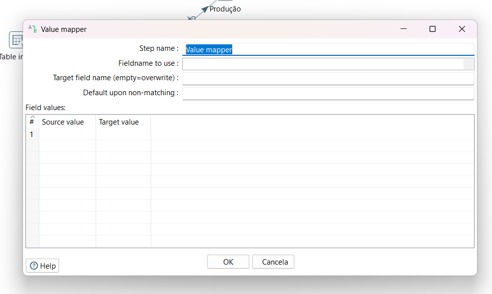

O step **Value mapper** (Mapeamento de Valores) é o famoso **"De -> Para"** do Pentaho.

Ele é a alternativa visual (e muito mais fácil) para não precisar escrever longos comandos `CASE WHEN` ou vários `IF/ELSE`. O objetivo dele é olhar para o conteúdo de uma coluna e substituir valores específicos por outros.

Um exemplo clássico: você recebe um arquivo onde o sexo dos clientes vem como "M" e "F", mas o seu banco de dados exige que seja salvo como "Masculino" e "Feminino". É exatamente isso que este step resolve!

Vamos detalhar cada campo da tela da sua imagem:

### 1. Configurações Principais (Cabeçalho)

* **Step name:** O nome da etapa no seu fluxo (ex: `Mapear Status do Cliente`).
* **Fieldname to use (Campo a ser usado):** É a coluna de origem. Qual é o campo que contém o dado que você quer avaliar e substituir? (Ex: a coluna `status_venda`).
* **Target field name (empty=overwrite) / Nome do campo de destino:** Aqui você tem duas escolhas arquiteturais muito importantes:
* *Se você preencher um nome aqui:* O Pentaho vai criar uma **nova coluna** com esse nome para guardar o valor transformado, mantendo a coluna original intacta.
* *Se você deixar em branco (empty):* O Pentaho vai **sobrescrever** a coluna original. O valor antigo some e o novo toma o lugar na mesma coluna.

* **Default upon non-matching (Padrão para não correspondência):** O que o Pentaho deve fazer se encontrar um valor que você não mapeou na grade abaixo? Se você deixar em branco, ele simplesmente mantém o valor original. Se você digitar algo aqui (ex: `Desconhecido` ou `Outros`), qualquer valor que não esteja na sua lista de regras receberá esse rótulo padrão.

### 2. Grade de Valores (Field values)

É aqui que você constrói o seu dicionário de tradução ("De -> Para").

* **Source value (Valor de origem):** O dado exato que está chegando do step anterior (o "De"). Exemplo: `1`.
* **Target value (Valor de destino):** O que esse dado deve virar (o "Para"). Exemplo: `Aprovado`.

*Nota sobre o funcionamento:* Você vai adicionando linhas para cada possibilidade. Ex:

* Linha 1: Source = `1` | Target = `Aprovado`
* Linha 2: Source = `2` | Target = `Pendente`
* Linha 3: Source = `3` | Target = `Cancelado`

---

### ⚠️ Dicas de Ouro e Boas Práticas (Para a Apostila)

1. **Tipagem de Dados (Cuidado ao sobrescrever):** Se a sua coluna original for do tipo *Integer* (Número Inteiro) e contiver o número `1`, e você tentar sobrescrevê-la (deixando o *Target field* em branco) com a palavra `Aprovado` (String/Texto), o Pentaho vai dar um **erro de tipagem**. Só sobrescreva a coluna original se o novo valor for do mesmo tipo (texto substituindo texto). Se for mudar o tipo numérico para texto, obrigatoriamente preencha o *Target field name* para criar uma coluna nova.
2. **Sensível a Maiúsculas e Minúsculas:** O *Value mapper* é "Case Sensitive". Ou seja, se você colocar que o Source value é `M` (maiúsculo), e no seu banco de dados chegar um `m` (minúsculo), ele não vai reconhecer e vai cair na regra do "Default". Sempre limpe e padronize seus textos (tudo maiúsculo, por exemplo, usando um *String operations*) antes de passá-los por este step.
3. **Limite de Uso:** Este step é maravilhoso para listas pequenas e fixas (status, estados, categorias). Porém, se você tiver uma tabela "De-Para" com 500 produtos ou se as regras mudarem todos os meses, **não use o Value mapper**. Nesse cenário, a melhor prática é guardar essas regras em uma tabela no banco de dados e usar o step **Stream lookup** ou **Database lookup** para cruzar as informações dinamicamente.

---

# Switch / case

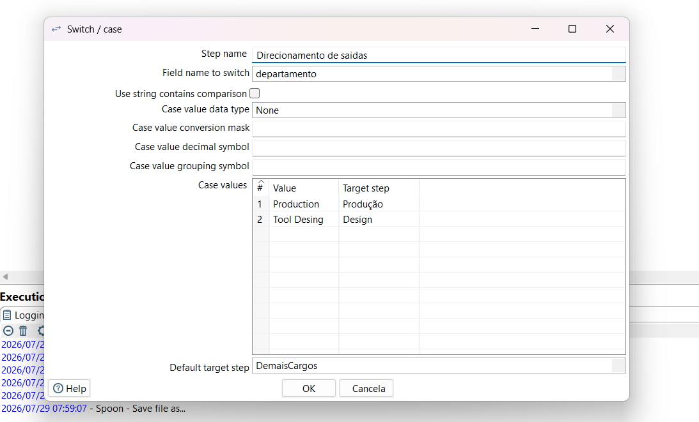

O step **Switch / case** é o grande "guarda de trânsito" do Pentaho. Ele é usado para **roteamento de dados**, ou seja, pegar um fluxo único de informações e dividi-lo em vários caminhos diferentes com base no valor de uma coluna.

Enquanto o step *Filter Rows* (Filtrar Linhas) só permite dois caminhos (Verdadeiro ou Falso), o *Switch / case* permite criar 3, 5, 10 ou quantas rotas de saída você precisar, deixando seu fluxo muito mais limpo e organizado.

Vamos detalhar cada campo da tela que você enviou para a sua apostila:

### 1. Configurações Principais (Cabeçalho)

* **Step name:** O nome da etapa (no seu caso, `Direcionamento de saidas`).
* **Field name to switch:** O campo (coluna) que o Pentaho vai avaliar para decidir o caminho da linha. No seu exemplo, ele vai olhar para o que está escrito na coluna `departamento`.
* **Use string contains comparison:**
* *Desmarcado (Padrão):* O Pentaho exige que a palavra seja **exatamente igual**.
* *Marcado:* O Pentaho vai procurar se a palavra *contém* o valor. Exemplo: se o valor procurado for "Prod", ele enviaria para o alvo qualquer linha que contivesse "Production", "Produto", "Sub-Prod", etc. (Funciona como um `LIKE` do banco de dados).


* **Case value data type / mask / symbols:** Configurações de formatação. Geralmente usamos o *Switch / case* com textos (Strings), então deixamos o tipo como `None`. Mas, se você estiver roteando o fluxo com base em uma Data ou um Número Decimal, você pode usar esses campos para garantir que o Pentaho leia a máscara corretamente (ex: `yyyy-MM-dd`) antes de fazer a comparação.

### 2. Grade de Roteamento (Case values)

É aqui que você define as regras de "Se o valor for X, mande para o step Y".
*Atenção: Para que os steps apareçam na lista suspensa do "Target step", você já deve ter arrastado esses steps para a tela do fluxo (canvas) e ligado o Switch / Case a eles.*

* **Value:** O dado exato que você está esperando encontrar na coluna `departamento`.
* **Target step:** Para qual step essa linha deve ser enviada se a condição for atendida.
* *No seu exemplo:*
* Se o departamento for `Production`, a linha vai para o step chamado `Produção`.
* Se o departamento for `Tool Desing`, a linha vai para o step chamado `Design`.

### 3. Caminho Padrão (Rodapé)

* **Default target step:** Este é o famoso "Caminho do Resto" (ou o `ELSE` da programação). Se a linha avaliada tiver um departamento que **não está listado** na grade acima (por exemplo, "RH" ou "TI"), para onde ela deve ir? No seu caso, você direcionou tudo que não for Produção ou Design para o step `DemaisCargos`.

---

### ⚠️ Dicas de Ouro e Boas Práticas (Para a Apostila)

1. **Cuidado com erros de digitação e Case Sensitive:** O Switch / case comum é extremamente sensível. Se você olhar o seu print, na linha 2 está escrito `Tool Desing` (com o N antes do G). Se no seu banco de dados a palavra vier escrita corretamente (`Tool Design`), o Pentaho não vai reconhecer a igualdade e essa linha vai acabar caindo no fluxo do `DemaisCargos` por engano! **Sempre copie e cole os valores exatos da fonte.**
2. **Uso de Dummy Steps:** É uma excelente prática colocar steps **Dummy** logo após o *Switch / case* para receber os dados de cada rota. Exemplo: você liga o Switch no "Dummy - Produção", e só a partir desse Dummy você continua as transformações. Isso deixa o desenho do fluxo muito mais organizado e fácil de testar.
3. **Não deixe o Default em branco:** Mesmo que você tenha mapeado todos os departamentos possíveis da sua empresa na grade, o mundo dos dados sempre traz surpresas (como valores nulos ou novas áreas criadas no sistema). Sempre preencha o *Default target step*, nem que seja apontando para um Dummy chamado `Lixo` ou `Erros_Nao_Mapeados`, para evitar que dados se percam silenciosamente.

---

# Filter rows

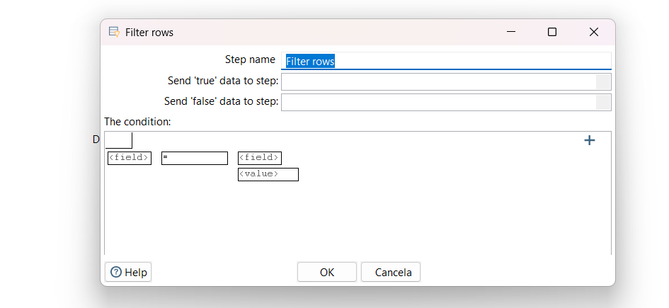

Excelente! O step **Filter rows** (Filtrar linhas) é um dos pilares de qualquer transformação no Pentaho. Se o *Switch / case* que vimos antes é um roteador para vários caminhos, o *Filter rows* é o clássico **"Bifurcador" (IF / ELSE)**.

Ele avalia uma condição lógica (ex: `idade > 18`) e divide o fluxo em exatamente dois caminhos: o que é Verdadeiro (True) e o que é Falso (False). É o equivalente direto à cláusula `WHERE` do SQL.

Vamos detalhar a interface que aparece no seu print para a sua apostila:

### 1. Roteamento de Saída (Cabeçalho)

* **Step name:** O nome da etapa (ex: `Filtrar Maiores de Idade`).
* **Send 'true' data to step:** Para qual step a linha deve ir se ela **passar** na regra (condição verdadeira).
* **Send 'false' data to step:** Para qual step a linha deve ir se ela **falhar** na regra (condição falsa).
* *Observação:* Para que os nomes dos próximos steps apareçam nessas duas caixinhas, você precisa primeiro arrastá-los para a tela (canvas) e ligar o *Filter rows* a eles. Ao fazer a ligação, o Pentaho vai perguntar se a seta é para o caminho "True" (que ficará com um ícone verde) ou "False" (ícone vermelho).

### 2. Construtor de Condições (The condition)

Esta área central é totalmente interativa. Você não digita a regra diretamente; você **clica** nos elementos para configurá-los:

* **`<field>` (Lado Esquerdo):** Ao clicar aqui, o Pentaho abre a lista de colunas que estão chegando do fluxo. Você escolhe qual campo quer testar (ex: `valor_venda`).
* **`=` (Operador Central):** Ao clicar no sinal de igual, você pode mudar o tipo de comparação. As opções incluem:
* `=`, `<>`, `<`, `>` (Igual, Diferente, Menor, Maior).
* `IS NULL` / `IS NOT NULL` (Verifica se o campo está vazio ou preenchido).
* `IN LIST` (Verifica se o valor está dentro de uma lista separada por ponto e vírgula, ex: `SP;RJ;MG`).
* `CONTAINS` (Se um texto contém outro, similar ao `LIKE` do banco de dados).


* **`<field>` ou `<value>` (Lado Direito):** Com o que você está comparando o lado esquerdo?
* Se clicar em `<field>`, você pode comparar duas colunas da mesma linha (ex: `data_entrega > data_prevista`).
* Se clicar em `<value>`, você digita um valor estático manual (ex: `1000`). Você precisará definir o tipo de dado (String, Number, etc.) nessa janelinha.


* **Sinal de `+` (Canto Direito):** Serve para adicionar mais regras. Ao clicar nele, você pode criar lógicas complexas combinando **AND** (E) e **OR** (OU). *Exemplo: `valor_venda > 1000` AND `status = 'Aprovado'*`.
* **Quadrado vazio (Canto Esquerdo):** Serve para aplicar a condição **NOT** (Não) na regra inteira, invertendo a lógica.

---

### ⚠️ Dicas de Ouro e Boas Práticas (Para a Apostila)

1. **Filtre o mais cedo possível:** Para manter seu pipeline rápido, coloque o *Filter rows* o mais próximo possível da leitura do arquivo/banco de dados. Se você sabe que só precisa processar vendas de 2024, não faça cálculos complexos com todos os anos para só filtrar no final. Elimine o lixo logo na entrada! (Claro, se a origem for um banco de dados, o ideal é já trazer filtrado no `WHERE` da sua query SQL no *Table Input*).
2. **O Destino do "False":** Se você só quer manter as linhas verdadeiras e descartar completamente as falsas, aponte o `Send 'false' data to step` para um step **Dummy**. Isso evita que o Pentaho acumule essas linhas na memória ou gere avisos no log de execução.
3. **Cuidado com valores Nulos (Nulls):** Se você quer filtrar linhas onde a coluna de nome está vazia, **NUNCA** use a regra `<field> = <value> (vazio)`. Valores nulos em banco de dados e no Pentaho não são iguais a "nada", eles são "desconhecidos". Use sempre o operador **`IS NULL`**.

---

# If field value is null

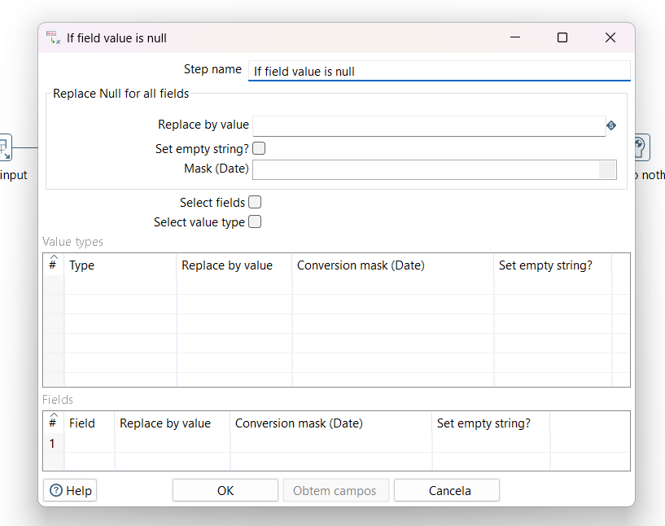

Excelente adição! O step **If field value is null** (Se o valor do campo for nulo) é a ferramenta definitiva para tratar a ausência de dados no Pentaho. Ele é o equivalente direto às funções `IFNULL`, `NVL` ou `COALESCE` dos bancos de dados relacionais.

Quando você extrai dados de sistemas diferentes, é muito comum que campos venham vazios (nulos). Inserir dados nulos em tabelas que não permitem isso (campos `NOT NULL`) causa erros fatais no fluxo. Este step resolve esse problema preenchendo os "buracos" com valores padrão definidos por você.

A tela deste step é muito inteligente, pois permite tratar os nulos de três formas diferentes: **Global, por Tipo de Dado ou por Campo Específico**. Vamos detalhar cada bloco para a sua apostila:

### 1. Bloco "Replace Null for all fields" (Substituição Global)

Se você não marcar nenhuma caixinha extra, as configurações que você colocar aqui serão aplicadas a **todas as colunas** do seu fluxo que passarem por este step.

* **Step name:** O nome da etapa (ex: `Tratar Nulos`).
* **Replace by value:** O valor que vai entrar no lugar do nulo. (Ex: se você digitar `0`, todos os nulos do fluxo virarão zero).
* **Set empty string?:** Se você marcar esta caixa, o Pentaho vai ignorar o que você digitou no campo acima e vai substituir todos os nulos por uma "String Vazia" (um texto sem nenhum caractere).
* **Mask (Date):** Se a substituição global for afetar campos de data, você deve colocar a máscara aqui (ex: `yyyy-MM-dd`) para que o Pentaho consiga converter o seu texto padrão para uma data válida.

### 2. Os Checkboxes de Direcionamento (Muito Importantes!)

Para não aplicar uma regra cega em todas as colunas, o Pentaho oferece duas caixas de seleção que habilitam as grades inferiores da tela:

* **Select fields (Selecionar campos):** Habilita a grade inferior ("Fields"). Use isso se você quiser tratar apenas colunas específicas pelo nome.
* **Select value type (Selecionar tipo de valor):** Habilita a grade do meio ("Value types"). Use isso se você quiser tratar os nulos com base no tipo do dado, independentemente do nome da coluna.

*Observação: Você pode marcar as duas caixas ao mesmo tempo. O Pentaho dará prioridade à regra do campo específico e, se não encontrar, aplicará a regra do tipo de dado.*

### 3. Grade do Meio: Value types (Tratamento por Tipo)

Esta é a opção favorita dos desenvolvedores para manter o fluxo limpo. Em vez de listar 50 colunas, você cria regras gerais.

* **Type:** Você escolhe o tipo de dado (String, Integer, Number, Date, etc.).
* **Replace by value / Set empty string?:** Define a regra para aquele tipo.
* *Exemplo prático:* Você pode configurar para que **todo** campo do tipo *Integer* que for nulo vire `0`, e **todo** campo do tipo *String* que for nulo vire `N/A`.

### 4. Grade Inferior: Fields (Tratamento por Coluna Específica)

Esta é a abordagem cirúrgica. Se você habilitou o checkbox "Select fields", você listará aqui exatamente quais colunas quer tratar.

* **Field:** O nome da coluna (ex: `data_cancelamento`). Você pode clicar no botão **Obtem campos** lá embaixo para carregar todos de uma vez e apagar os que não quer usar.
* **Replace by value / Mask / Set empty string?:** As mesmas opções que já vimos, mas agora exclusivas para esta coluna.
* *Exemplo prático:* Se a coluna `data_cancelamento` for nula, substitua pelo valor `2099-12-31` usando a máscara `yyyy-MM-dd`.


* **Set empty string (Y) + Replace by value (Preenchido):** O Pentaho **ignora** o texto preenchido e força a String Vazia (`""`). O "Set empty string" sempre tem prioridade.
* **Set empty string (N) + Replace by value (Preenchido):** O Pentaho troca o NULL pelo texto exato que você digitou (ex: "Desconhecido", "0", "N/A").
* **Set empty string (N) + Replace by value (Em branco):** O Pentaho **não faz absolutamente nada**. O dado entra como `NULL` e sai como `NULL`.

É por isso que esses dois campos trabalham sempre em dupla. Você escolhe se quer preencher o vazio com um conteúdo específico (Replace by value) ou se quer apenas criar a "caixa de papelão vazia" (Set empty string)!

---

### ⚠️ Dicas de Ouro e Boas Práticas (Para a Apostila)

1. **Respeite a Tipagem:** O maior erro de quem começa a usar este step é tentar colocar um texto como "Desconhecido" dentro de uma coluna que é do tipo Número Inteiro (*Integer*). O Pentaho vai gerar um erro de conversão de dados (Data Type Mismatch) e quebrar o fluxo. A regra é: substitua números por números, textos por textos e datas por datas.
2. **Nulo é diferente de String Vazia:** Em banco de dados, `NULL` significa ausência de informação ("não sei o que tem aqui"). Uma `String Vazia` ("") significa que a informação existe, e a informação é "em branco". Marcar a opção **Set empty string?** ajuda muito quando o seu banco de dados recusa inserções de `NULL`, mas aceita campos de texto em branco.
3. **Use a grade "Value types" para ganhar tempo:** Se você tem uma tabela com 100 colunas que permite tratar zeros em colunas numéricas nulas, não liste as 100 colunas na grade inferior. Basta colocar uma única linha na grade do meio dizendo: `Type: Number -> Replace by value: 0`. Isso deixa o seu step extremamente elegante e fácil de dar manutenção!

---

# Java Filter

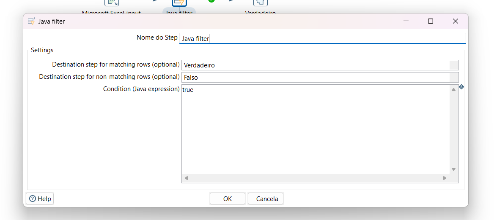


Excelente! Chegamos a um nível mais avançado com este. O **Java filter** (Filtro Java) é o "irmão mais velho e bombado" do step *Filter rows* que vimos anteriormente.

Enquanto o *Filter rows* tem uma interface gráfica amigável de apontar e clicar, o **Java filter** exige que você escreva a regra de negócio digitando código diretamente na linguagem Java.

**Por que usar isso se é mais difícil?** Pela **Performance e Flexibilidade**. Como o Pentaho é feito em Java, quando você escreve a regra nativamente aqui, ele não precisa "traduzir" a interface visual. O processamento se torna absurdamente rápido (ótimo para tabelas com dezenas de milhões de linhas) e você ganha acesso a todo o poder das fórmulas e bibliotecas da linguagem Java.

Vamos detalhar a tela do seu print para a apostila:

### 1. Configurações de Roteamento (Settings)

Exatamente como no filtro padrão, este step divide o fluxo em dois caminhos. No seu print, você já configurou isso perfeitamente:

* **Nome do Step:** O nome da etapa no fluxo (ex: `Java filter`).
* **Destination step for matching rows:** Para qual step a linha vai se a condição Java retornar `True` (Verdadeiro). No seu caso, está apontado para um step chamado `Verdadeiro`.
* **Destination step for non-matching rows:** Para qual step a linha vai se a condição retornar `False` (Falso). No seu caso, apontado para o step `Falso`.

### 2. O Coração do Step (Condition)

* **Condition (Java expression):** É aqui que você digita o seu código. No seu print, está escrito apenas a palavra `true`. Isso significa que, do jeito que está, **todas as linhas vão passar direto para o step "Verdadeiro"**, pois a condição é sempre absoluta.

Para fazer isso funcionar na prática, você deve usar o **nome das colunas** que vêm do fluxo como se fossem variáveis no código, e a expressão final deve obrigatoriamente resultar em um booleano (`true` ou `false`).

#### Exemplos práticos de uso (Para copiar e colar na apostila):

* **Comparações Numéricas Simples:**
`idade >= 18`
* **Múltiplas Condições (Usando E/OU do Java):**
`idade >= 18 && salario > 2000.0` (O `&&` significa AND).
`status == 1 || status == 2` (O `||` significa OR).
* **Tratando Textos (Strings) - ⚠️ MUITO IMPORTANTE:**
Em Java, você **não pode** usar `==` para comparar textos. Você deve usar a função `.equals()`.
*Certo:* `departamento.equals("Producao")`
*Errado:* `departamento == "Producao"`
* **Funções de Texto Avançadas:**
`nome.startsWith("A")` (Deixa passar só quem tem o nome começando com a letra A).
`cpf.length() == 11` (Verifica se o tamanho do texto tem exatos 11 caracteres).

---

### ⚠️ Dicas de Ouro e Boas Práticas (O Perigo dos Nulos)

A maior causa de erros ao usar o **Java filter** é esquecer que o banco de dados pode mandar valores nulos (`NULL`).

Se a coluna `departamento` chegar nula e o seu código for `departamento.equals("TI")`, o Java vai tentar executar a função `.equals()` em um "nada", o que vai gerar um erro fatal chamado **NullPointerException**, derrubando todo o seu fluxo.

**A Regra de Ouro:** Sempre teste se o campo é nulo antes de fazer qualquer verificação de texto usando o operador `!= null` combinado com o `&&` (AND):

> **Forma Segura e Profissional de Filtrar Textos:**
> `departamento != null && departamento.equals("TI")`

*(Dessa forma, se o departamento for nulo, a primeira parte da regra dá falso, o Java nem tenta ler a segunda parte, e a linha é enviada em segurança para o caminho "Falso" sem quebrar o Pentaho!)*

### ⚠️ Bônus: Deixando o código "Blindado" (Null-Safe)

Lembrando da regra de ouro sobre valores nulos que vai para a sua apostila: se, por acaso, vier uma linha no seu banco de dados onde a coluna `sexo` esteja em branco (`NULL`), a expressão `sexo.equals("F")` vai gerar um erro fatal (*NullPointerException*) e quebrar o seu Pentaho.

Para evitar isso de forma elegante e profissional, inverta a ordem da comparação colocando o texto fixo na frente (uma técnica conhecida pelos programadores como *Yoda Condition*). O código perfeito e à prova de falhas fica assim:

```java
idade > 30 && "F".equals(sexo)

```

Dessa forma, o Java testa se a letra "F" é igual ao conteúdo da coluna `sexo`. Se a coluna for nula, ele simplesmente diz "Falso" e a linha vai pacificamente para o step "Falso", sem gerar nenhum erro! Faça essa alteração e teste novamente, vai funcionar de primeira.

---

# Replace in string

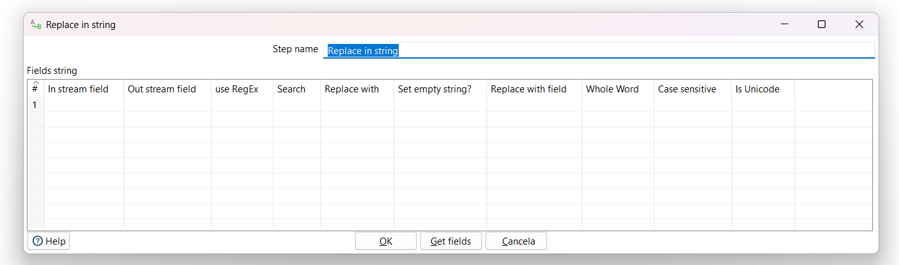

Com certeza! Mais um step clássico e indispensável para a sua apostila. O **Replace in string** (Substituir na String) é, de forma resumida, a função "Localizar e Substituir" (Ctrl+H) do Word ou Excel, mas com superpoderes para processar milhões de linhas.

Ele é a ferramenta perfeita para **limpeza de dados**. Sabe quando você recebe um CPF cheio de pontos e traços (`123.456.789-00`) e precisa enviar para o banco de dados apenas os números (`12345678900`)? É este step que faz o trabalho sujo!

Vamos detalhar cada coluna dessa grade para a sua documentação:

### 1. Configurações de Origem e Destino

* **Step name:** O nome da etapa (ex: `Limpar CPF e Telefone`).
* **In stream field:** A coluna de origem. Qual é o campo que contém o texto que você quer alterar?
* **Out stream field:** Aqui você tem a mesma escolha arquitetural do *Value mapper*:
* *Se você preencher um nome aqui:* O Pentaho cria uma **nova coluna** com o texto alterado.
* *Se você deixar em branco:* O Pentaho **sobrescreve** a coluna original, substituindo o texto antigo pelo novo.

### 2. Regras de Busca e Substituição

* **use RegEx:** Define como o Pentaho vai interpretar o campo "Search".
* *N (Não):* Busca literal. Se você procurar por "A", ele acha exatamente a letra "A".
* *Y (Sim):* Ativa as Expressões Regulares (RegEx). Permite buscas complexas. *Ex: `[0-9]` encontra qualquer número no texto.*

* **Search:** O texto (ou padrão RegEx) que você está procurando e quer remover/alterar.
* **Replace with:** O novo texto que vai entrar no lugar.
* **Set empty string?:** Lembra da nossa regra da "caixa vazia"? Se você marcar `Y` aqui, o Pentaho ignora o campo "Replace with" e simplesmente **apaga** o termo pesquisado, deixando nada no lugar. *(Excelente para apagar os pontos e traços do CPF, por exemplo).*
* **Replace with field:** Uma opção dinâmica incrível! Em vez de digitar um texto fixo no "Replace with", você pode selecionar outra coluna do seu fluxo para ser o valor substituto.

### 3. Filtros de Precisão (Opções Avançadas)

* **Whole Word:** Se `Y` (Sim), o Pentaho só substitui se encontrar a palavra inteira isolada.
* *Exemplo:* Se você buscar por "sol" e trocar por "lua", a palavra "girassol" **não** vai virar "giraslua". Ele só troca se a palavra "sol" estiver sozinha.

* **Case sensitive:** Se `Y` (Sim), ele diferencia maiúsculas de minúsculas. Buscar por "Rua" será diferente de buscar por "rua".
* **Is Unicode:** Marque como `Y` apenas se você estiver tentando localizar e substituir caracteres especiais de Unicode (como símbolos específicos ou emojis que venham no texto). Para letras, números e pontuações normais, deixe em `N`.

---

### ⚠️ Dicas de Ouro e Boas Práticas (Para a Apostila)

1. **Limpeza de CPF/CNPJ em um único passo:** Em vez de criar um step para tirar o ponto (`.`) e outro step para tirar o traço (`-`), você pode fazer tudo na mesma linha! Coloque `Y` no **use RegEx**, digite `[.-]` no campo **Search** e marque o **Set empty string?**. O Pentaho vai varrer o texto e apagar todos os pontos e traços de uma vez só!
2. **Múltiplas substituições na mesma coluna:** Você pode adicionar várias linhas na grade apontando para o mesmo campo no **In stream field**. O Pentaho vai executá-las em ordem (de cima para baixo). *Exemplo: Linha 1 troca "R." por "Rua", Linha 2 troca "Av." por "Avenida" no mesmo campo de endereço.*
3. **Só funciona com Textos (Strings):** Como o próprio nome diz, este step foi feito para manipular Strings. Não tente usá-lo para alterar números (Integer/Number) ou Datas, pois pode gerar erros de tipagem. Se precisar, converta os dados para texto antes (usando um *Select values*)!

---

# Strings cut

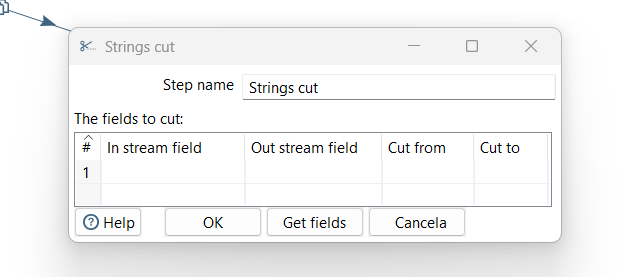


Excelente! O step **Strings cut** (Cortar Strings) tem uma interface bem enxuta, mas resolve problemas pontuais com muita eficiência.

Na linguagem de banco de dados e programação, ele é o equivalente exato à função **`SUBSTRING`**. Ou seja, ele serve para extrair apenas um "pedaço" de um texto, baseando-se na **posição (número)** dos caracteres.

Ele é diferente do *Split fields* (que usava um delimitador como vírgula ou traço). O *Strings cut* é cego para delimitadores; ele simplesmente conta caracteres e corta. É perfeito para arquivos de tamanho fixo (onde você sabe que os primeiros 4 caracteres são sempre o ano, por exemplo).

Vamos detalhar a grade (The fields to cut) para a sua apostila:

### 1. Configurações de Origem e Destino

* **Step name:** O nome da etapa (ex: `Extrair DDD do Telefone`).
* **In stream field:** A coluna de origem que contém o texto completo que será cortado.
* **Out stream field:** A mesma regra de ouro dos steps de string anteriores:
* *Se preencher um nome:* Cria uma **nova coluna** com o pedaço recortado.
* *Se deixar em branco:* **Sobrescreve** a coluna original com o texto recortado, apagando o texto longo original.


### 2. A Matemática do Corte (Atenção às posições!)

Esta é a parte mais importante deste step. O Pentaho, sendo construído em Java, começa a contar os caracteres **a partir do ZERO** (e não do número 1).

* **Cut from (Cortar de):** O índice (posição) onde o corte deve **começar**. Esta posição é *inclusiva* (o caractere desta posição fará parte do resultado).
* **Cut to (Cortar até):** O índice (posição) onde o corte deve **parar**. Esta posição é *exclusiva* (o corte para *antes* deste caractere, ele não entra no resultado).

#### 💡 Exemplos Práticos (Para anotar na apostila)

Imagine que o texto na sua coluna seja a palavra **PENTAHO**.
Na memória do computador, as posições são:

* P = 0
* E = 1
* N = 2
* T = 3
* A = 4
* H = 5
* O = 6

**Cenário A: Pegar os 3 primeiros caracteres ("PEN")**

* **Cut from:** `0` (Começa no P)
* **Cut to:** `3` (Para antes do T)

**Cenário B: Pegar o final da palavra ("TAHO")**

* **Cut from:** `3` (Começa no T)
* **Cut to:** `7` (Você coloca o limite total do tamanho, mesmo o último índice sendo 6, para garantir que ele pegue até o fim).

---

### ⚠️ Dicas de Ouro e Boas Práticas (Para a Apostila)

1. **Ideal para Padrões Fixos:** Este step brilha quando a informação tem sempre o mesmo tamanho. *Exemplos: Pegar os 2 primeiros números de um campo de CEP (`01153-000`) para descobrir a região, ou extrair o mês de uma data no formato texto (`20240729` -> Cut from 4, Cut to 6 = `07`).*
2. **Fujam de Textos Variáveis:** Nunca use este step para tentar separar o Primeiro Nome do Sobrenome de uma pessoa. Como os nomes têm tamanhos diferentes (ex: "Ana" tem 3 letras, "Roberto" tem 7), cortar pelo número da posição vai quebrar seus dados. Para textos de tamanho variável, use o *Split fields* ou o *String operations* (que veremos mais para frente).
3. **Use o botão Get fields:** Assim como nos outros steps, clicar em `Get fields` puxa todas as colunas de texto do fluxo para a grade automaticamente, poupando você de digitar os nomes. Depois, é só apagar as linhas que não vai usar.

---

# Calculator

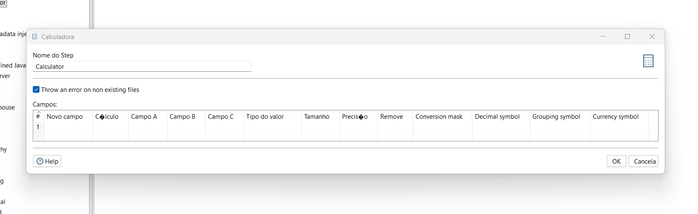

Embora o nome sugira apenas matemática básica, este step é um verdadeiro "canivete suíço" ultrarrápido para operações matemáticas, manipulação de textos e, principalmente, **cálculos com datas**.

Para a sua apostila, o ponto mais importante a destacar é a **performance**. A Calculadora do Pentaho usa algoritmos pré-compilados que rodam de forma absurdamente rápida. Sempre que você puder escolher entre fazer uma conta básica aqui ou usar um código complexo no step *Java / JavaScript*, escolha a Calculadora!

Vamos destrinchar as colunas da grade (Campos) para a sua documentação:

### 1. Definição do Cálculo e Operandos

* **Novo campo (New field):** O nome da nova coluna que vai guardar o resultado da sua conta. Diferente de outros steps, a Calculadora **sempre cria colunas novas**, ela não sobrescreve a original.
* **Cálculo (Calculation):** O coração do step. Ao clicar nesta célula, você verá uma lista gigante de operações prontas. As mais usadas são:
* *Matemática:* `A + B`, `A - B`, `A * B`, `A / B`.
* *Datas:* `Date A - Date B (in days)` (Diferença de dias entre duas datas), `Date A + B Days` (Soma dias a uma data).
* *Textos:* `A + B` (Concatena textos), `Return only digits from string A` (Extrai só números de um texto, ótimo para CPFs).

* **Campo A, Campo B e Campo C:** São as colunas de origem que servirão como as "peças" do seu cálculo.
* Se a operação for `A + B`, você deve preencher o Campo A e o Campo B.
* Se for uma operação simples como `Square of A` (Quadrado de A), você só preenche o Campo A.
* O Campo C é raramente usado, apenas para cálculos muito específicos da lista, como `A + B * C`.

### 2. Formatação do Resultado

* **Tipo do valor (Value type):** Qual será o tipo de dado do resultado? (Number, Integer, String, Date). *Exemplo: se você dividiu dois números, o tipo deve ser Number para aceitar casas decimais.*
* **Tamanho e Precisão:** Define o limite de caracteres e as casas decimais do resultado.
* **Remove:** **[Opção Estratégica]** Se você marcar `Y` (Sim) aqui, o Pentaho faz a conta, mas deleta esse campo logo em seguida. *Para que serve isso?* É perfeito para criar "variáveis temporárias" (explicado nas dicas de ouro abaixo).
* **Conversion mask, Decimal/Grouping/Currency symbol:** Opções padrão para formatar o resultado final, caso seja uma data ou um valor financeiro.

*(Nota sobre o seu print: O checkbox "Throw an error on non existing files" que aparece ali no meio é um pequeno bug visual antigo da interface do PDI para traduções em português. Ele não tem função real na calculadora, então pode ignorá-lo!).*

---

### ⚠️ Dicas de Ouro e Boas Práticas (Anotações Críticas para a Apostila)

1. **A "Pegadinha" das Constantes:** Este é o maior erro de quem começa a usar a Calculadora. **Ela só faz contas entre COLUNAS**. Você **não pode** digitar um número diretamente (como "A * 10"). Se você quiser multiplicar o salário por 10, você precisa usar um step anterior chamado **Add constants** (Adicionar constantes) para criar uma coluna fixa com o valor `10`, e só então usar essa nova coluna como o `Campo B` na Calculadora.
2. **Cálculos em Cascata (Chaining):** A Calculadora resolve as contas linha por linha, de cima para baixo. Isso significa que você pode criar um "Novo campo" na Linha 1, e usar esse exato campo como "Campo A" na Linha 2!
* *Exemplo:*
* Linha 1: `subtotal = preco * quantidade`
* Linha 2: `total_com_imposto = subtotal + taxa`

3. **Use a opção "Remove" para manter o fluxo limpo:** No exemplo acima, se o seu banco de dados final só precisa da coluna `total_com_imposto`, você pode marcar a coluna `Remove` como `Y` na linha do `subtotal`. O Pentaho usará o subtotal para fazer a conta final e depois o jogará no lixo, evitando que colunas intermediárias poluam o seu dataset!